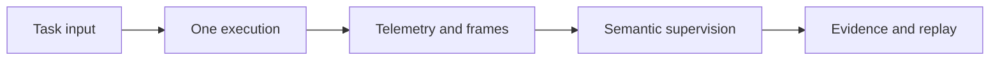

<p align="center">
  
</p>

<p align="center">
  <strong>Run once. Observe fully. Reproduce exactly.</strong><br>
  A local-first, open-source toolkit for robot debugging and supervision.
</p>

<p align="center">
  <a href="README.md">中文</a> · English · <a href="BRAND.md">Brand story</a>
</p>

## What is rolo?

**rolo** is short for **robot only loop once**. It captures a robotics development principle: run one bounded task loop at a time, retain its inputs, execution, observations, and result, then make failures explainable, reproducible, and fixable.

The final wordmark uses four independent lowercase letters. The single cobalt exit on the last `o` marks a definite end to one execution and a handoff to observation, reproduction, and the next decision—not an endless cycle. See [`BRAND.md`](BRAND.md) for the complete identity rationale.

This repository currently provides a local development harness for the Robot Debugging Agent engineering specification. The default profile runs without ROS, Docker, a camera, or an OpenAI API key. Example robots are represented by mock adapters while the production-facing CLI, API contracts, dynamic enrollment, capability manifests, execution monitor, and `robot_use` supervision path remain intact.



## Current capabilities

- Local-first: the default `mock` backend sends no images or data outside the machine.
- One interface: a FastAPI control plane and the `robotctl` CLI cover heterogeneous robots.
- Dynamic enrollment: assign any valid `robot_id` at installation and derive its capability config from differential-drive or Ackermann templates; identity is never compiled into the bundle.
- Automatic discovery: read-only probes inventory hardware, Linux, the ROS graph, and local application projects.
- Visual supervision: timestamped image storyboards and structured telemetry flow through a replaceable `robot_use` backend.
- Heterogeneous deployment: one ARM64 bundle supports Jetson Orin, RK3588, and Raspberry Pi 4/5 with robot-specific profiles selected during installation.
- Offline tests: core unit and API tests require neither a physical robot nor a cloud service.

> [!NOTE]
> This is an early MVP. The mock backend is useful for local validation, but it does not replace physical safety controls, emergency stops, collision detection, or human authorization on a real robot.

## Product capabilities

rolo is designed for autonomous debugging and testing on physical robots. It organizes every run as a bounded loop: define the task, execute actions, observe continuously, judge the result, preserve evidence, and let new evidence determine the next run.

> [!IMPORTANT]
> This section describes the complete product direction. Treat “Current capabilities” and the repository tests as the source of truth for what is available today; autonomous testing, tuning, and multi-robot orchestration will be delivered incrementally as the project evolves.

### 1. One run, one complete evidence loop

rolo does not treat a successful command return as task completion. Every execution should leave a replayable, explainable, and reproducible episode containing:

- issued commands and actual robot execution state;
- sensor data, system telemetry, and camera frames;
- parameter, software, and capability configuration versions;
- test verdicts, anomalous intervals, and diagnostic conclusions.

### 2. Canonical CLI

Heterogeneous degrees of freedom, actuators, sensors, and compute platforms are exposed through a canonical CLI. Higher-level agents receive consistent command formats, units, coordinate frames, timestamps, error codes, and rollback semantics across four layers:

- **Hardware**: sensors, actuators, buses, firmware, power, and hardware state;
- **Linux**: processes, services, networking, resources, files, and host performance;
- **Middleware**: nodes, topics, services, actions, TF, parameters, and diagnostics;
- **Application**: mapping, localization, navigation, manipulation, testing, tuning, and task state.

### 3. Active discovery

At first deployment, rolo assigns a unique `robot_id` and uses active discovery to generate a normalized capability manifest, semantic binding candidates, and a CLI tool catalog. Discovery covers compute and OS details, sensors, actuators, buses, Linux services, the ROS graph, local source projects, and existing vendor or application entry points.

### 4. `robot_use`

`robot_use` combines onboard or third-person cameras such as VICON with timestamped keyframes, task state, commands, odometry, and telemetry for multimodal analysis:

- low-frequency periodic supervision and state-change triggers;
- mandatory validation after test steps;
- high-frequency supervision triggered by anomalous telemetry;
- overlapping windows and multi-frame temporal understanding;
- coarse-to-fine video review when the error time is unknown.

### 5. Autonomous testing

Users can express structured constraints for speed, acceleration, target error, obstacle clearance, exclusion zones, maximum duration, sensor usage, and fault conditions. rolo's goal is to validate that constraints are explicit, executable, and observable, then derive coverage matrices, nominal/boundary/failure tests, state-transition and combinatorial tests, metamorphic and fault-injection tests, test oracles, risk levels, and execution order.

### 6. Autonomous tuning

Algorithm parameters are represented through a shared registry containing canonical names, units, current and default values, bounds, dependencies, restart or calibration requirements, risk levels, and rollback methods. Tuning follows a lifecycle of baseline → candidates → controlled trial → evaluation → regression → promote or roll back.

### 7. Autonomous and auditable operation

rolo uses state graphs to manage discovery, calibration, operation, mapping, localization, navigation, testing, diagnosis, tuning, and regression. Long-running tasks can create checkpoints containing configuration, active work, test progress, and evidence indexes. Multiple robots can run the same agent and test DSL while preserving independent identities, parameters, state, and evidence.

The original product feature document remains available in [`PRODUCT_FEATURES.md`](PRODUCT_FEATURES.md).

## Quick start

### Prerequisites

- Windows PowerShell 5.1+
- [`uv`](https://docs.astral.sh/uv/)
- Python 3.12 managed by `uv`

ROS 2 and FFmpeg are optional in the local mock profile. They become relevant when real robot and camera adapters are connected.

### Install and run

```powershell
Copy-Item .env.example .env
uv sync --dev
uv run robotctl doctor
uv run robotctl robots
uv run robotctl serve
```

The API is available at `http://127.0.0.1:8080`; interactive OpenAPI documentation is at `http://127.0.0.1:8080/docs`.

Local manual validation follows the production startup order. Start the minimal, non-motion
bootstrap daemon in terminal 1:

```powershell
uv run robotctl bootstrap-agentd --robot demo_diff --port 8100
```

Then run discovery and start the full agentd in terminal 2:

```powershell
uv run robotctl discover run --robot demo_diff --source-root .
uv run robotctl agentd --robot demo_diff --port 8101
```

Before enrolling a physical robot into an empty config root, verify its structure, sensors, and hard safety bounds, then explicitly confirm the selected profile:

```powershell
$env:ROBOT_LOOP_CONFIG_DIR = "C:\robot-loop-config"
uv run robotctl enroll profiles
uv run robotctl enroll init --robot-id my_robot_01 --profile differential_drive --confirm-safety-profile
uv run robotctl enroll show
```

Each installed instance owns one `robot_id`. Replacing an existing identity or structure profile requires a separate migration.

Run checks:

```powershell
uv run pytest
uv run ruff check .
```

## Automatic discovery and canonical CLI

Run bounded, read-only discovery against a local application workspace:

```powershell
uv run robotctl discover run --robot demo_diff --source-root C:\path\to\robot-application
uv run robotctl discover show --robot demo_diff
uv run robotctl tool catalog --robot demo_diff
```

The program inventories hardware, the host software stack, the live ROS graph, and local source projects. It writes a normalized capability manifest, semantic binding candidates, and a canonical tool catalog under `artifacts/discovery/<robot_id>/latest`.

Each layer also has a direct entry point:

```powershell
uv run robotctl hw inventory scan
uv run robotctl linux host inspect
uv run robotctl ros graph snapshot
uv run robotctl app robot discover
```

See [`AUTODISCOVERY.md`](AUTODISCOVERY.md) for the evidence model and safety boundaries.

## `robot_use` backends

The default backend is `mock`. To enable the OpenAI backend, set these environment variables securely outside source control:

```powershell
$env:ROBOT_USE_BACKEND = "openai"
$env:OPENAI_API_KEY = "..."
$env:OPENAI_MODEL = "an-image-capable-model-available-to-your-project"
```

The implementation sends timestamped image storyboards and structured telemetry. It performs no local visual detection and does not grant the model safety authority.

## Common ARM64 installation bundle

The deployment baseline is ARM64 + Ubuntu 22.04 + ROS 2 Humble. Build the archive with:

```powershell
.\scripts\build_bundles.ps1
```

This creates `dist/release/robot-loop-0.1.0-arm64.zip`. Transfer the same archive to each robot, then choose a profile from its physical structure and sensors and assign its identity:

```bash
sudo bash install.sh my_robot_01 differential_drive --confirm-safety-profile
```

The installer verifies ARM64, Ubuntu 22.04, ROS 2 Humble, and every payload checksum before generating that robot's capability config. Newly discovered bindings and calibration remain unavailable until they pass verification.

systemd enforces `bootstrap-agentd -> discovery -> agentd`. The bootstrap daemon exposes only
robot identity, safety-profile, and clock status. The full agentd starts only after discovery has
persisted a non-`FAILED` report. A `PARTIAL` report starts the full agentd in `DEGRADED`; if
discovery fails, the bootstrap daemon remains available while the full agentd stays stopped.

The current MVP resolves Python dependencies from the robot's configured package index. An offline production install will also need an ARM64 wheelhouse. Platform-specific ROS and vendor drivers remain implementations behind the same canonical adapter contract.

## Project layout

```text
src/robot_loop/       API, CLI, domain models, and adapters
configs/local/        Capability manifests for local mock examples
configs/profiles/     Enrollable structure and sensor templates
configs/deployment/   Common deployment and service configuration
configs/platforms/    ARM64 compatibility and supported-compute manifest
configs/robot_use.yaml
configs/discovery.yaml
schemas/              Exported JSON Schemas
tests/                Offline unit and API tests
scripts/              Development and bundle-build helpers
assets/brand/         rolo brand assets
artifacts/            Runtime output, ignored by Git
```

For the full engineering specification, see [`robot_debugging_agent_6h_demo_spec.md`](robot_debugging_agent_6h_demo_spec.md).

## Contributing

Issues that include a robot platform, reproduction steps, and expected behavior are welcome. Pull requests should stay small and verifiable. Before submitting, run:

```powershell
uv run pytest
uv run ruff check .
```

See [`BRAND.md`](BRAND.md) for the identity story and logo usage rules.
