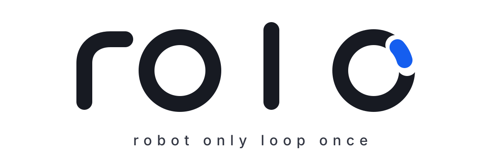
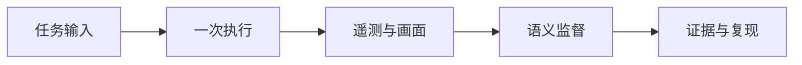

<p align="center">
  
</p>

<p align="center">
  <strong>只执行一次，完整观察，精确复现。</strong><br>
  面向机器人调试与监督的本地优先开源工程。
</p>

<p align="center">
  中文 · <a href="README.en.md">English</a> · <a href="BRAND.md">品牌理念</a>
</p>

## rolo 是什么

**rolo** 是 **robot only loop once** 的缩写。它表达的是一种机器人开发原则：每次只运行一个边界清晰的任务闭环，并把输入、执行、观察和结果保留下来，让问题能够被解释、复现和修正。

最终字标由四个彼此独立的小写字母组成；最后一个 `o` 上唯一的蓝色出口表示一次执行明确结束，并把证据交给观察、复现和下一次决策，而不是无止境地循环。完整说明见 [`BRAND.md`](BRAND.md)。

本仓库当前提供 Robot Debugging Agent 工程规格的本地开发框架。默认配置无需 ROS、Docker、相机或 OpenAI API Key；本地示例机器人由 mock adapter 模拟，同时保留正式环境使用的 CLI、API 契约、动态注册、能力清单、执行监控和 `robot_use` 监督路径。



## 当前能力

- 本地优先：默认 `mock` 后端不向机器外发送图像或数据。
- 统一接口：使用 FastAPI 控制面和 `robotctl` 命令行管理不同机器人。
- 动态注册：安装时分配任意合规 `robot_id`，并从差速或阿克曼结构模板生成能力配置；机器人身份不编译进安装包。
- 自动发现：只读探测硬件、Linux、ROS 图和本地应用工程，生成规范化能力清单。
- 视觉监督：将带时间戳的画面故事板与结构化遥测交给可替换的 `robot_use` 后端。
- 异构部署：同一份 ARM64 安装包支持 Jetson Orin、RK3588 和 Raspberry Pi 4/5，并在安装时启用机器人专属配置。
- 离线测试：核心单元测试和 API 测试不依赖真实机器人或云端服务。

> [!NOTE]
> 当前版本是开发中的 MVP。模拟后端适合本地验证，但不替代真实机器人上的安全控制、急停、碰撞检测或人工授权。

## 产品特性

rolo 面向真实机器人的自主调试与测试，把每次运行组织成一个边界清晰的闭环：定义任务、执行动作、持续观察、判断结果、保留证据，再根据新的证据决定下一次运行。

> [!IMPORTANT]
> 本节描述完整产品方向。已经可用的范围以“当前能力”和仓库测试为准；自主测试、调优及多机器人编排等能力仍会随项目演进逐步实现。

### 1. 一次运行，一个完整证据闭环

rolo 不把“命令成功返回”视为任务完成。每次执行都应留下可以回放、解释和复现的 episode，包括：

- 下发命令与机器人实际执行状态；
- 传感器、系统遥测和相机画面；
- 参数、软件和能力配置版本；
- 测试判定、异常区间与诊断结论。

### 2. 标准 CLI

异构机器人的自由度、执行器、传感器和计算平台统一通过标准 CLI 暴露。上层 Agent 面对一致的命令格式、单位、坐标系、时间戳、错误码和回滚语义。软件栈分为四层：

- **Hardware**：传感器、执行器、总线、固件、电源与硬件状态；
- **Linux**：进程、服务、网络、资源、文件与系统性能；
- **Middleware**：节点、Topic、Service、Action、TF、参数与诊断信息；
- **Application**：建图、定位、导航、操作、测试、调优与任务状态。

### 3. 主动发现

首次部署时，rolo 为机器人分配唯一 `robot_id`，并通过主动发现生成标准化 capability manifest、语义绑定候选和 CLI tool catalog。发现范围包括计算平台、系统版本、传感器、执行器、总线、Linux 服务、ROS 图、本地源码工程以及已有的厂商和应用入口。

### 4. `robot_use`

`robot_use` 可组合机器人本体或第三视角相机（如 VICON）、带时间戳的关键帧、任务状态、控制命令、里程计和遥测，用于多模态分析：

- 低频周期监督与状态变化触发；
- 测试步骤结束后的强制验证；
- 异常遥测触发的高频监督；
- 重叠时间窗与多帧时序理解；
- 未知错误时刻的粗到细录像回溯。

### 5. 自主测试

用户可以结构化描述速度、加速度、目标误差、障碍物距离、禁入区、最长任务时间、传感器限制和故障条件。rolo 的目标是验证约束是否明确、可执行和可观测，并据此生成覆盖矩阵、正常/边界/异常测试、状态转换与组合测试、变形与故障注入测试、测试 Oracle、风险等级和执行顺序。

### 6. 自主调优

算法参数通过统一注册表表达，包括标准名称、单位、当前值、默认值、范围、依赖关系、重启或标定要求、风险等级与回滚方法。调优遵循“建立基线 → 生成候选 → 受控试运行 → 评估 → 回归 → 固化或回滚”的生命周期。

### 7. 自治与可审计

rolo 使用状态图管理发现、标定、操作、建图、定位、导航、测试、诊断、调优和回归。长时间任务可以生成 checkpoint，记录当前配置、活动任务、测试进度和证据索引。多台机器人可以运行相同的 Agent 和测试 DSL，同时保持独立身份、参数、状态与证据。

原始产品特性说明保留在 [`PRODUCT_FEATURES.md`](PRODUCT_FEATURES.md)。

## 快速开始

### 环境要求

- Windows PowerShell 5.1+
- [`uv`](https://docs.astral.sh/uv/)
- 由 `uv` 管理的 Python 3.12

ROS 2 和 FFmpeg 对本地 mock 模式是可选项；接入真实机器人和相机后才需要它们。

### 安装与运行

```powershell
Copy-Item .env.example .env
uv sync --dev
uv run robotctl doctor
uv run robotctl robots
uv run robotctl serve
```

API 默认运行在 `http://127.0.0.1:8080`，OpenAPI 文档位于 `http://127.0.0.1:8080/docs`。

本地手工验证遵循与真机相同的启动顺序。先在终端 1 启动只读、不可运动的最小 bootstrap daemon：

```powershell
uv run robotctl bootstrap-agentd --robot demo_diff --port 8100
```

然后在终端 2 完成一次发现，再启动完整 agentd：

```powershell
uv run robotctl discover run --robot demo_diff --source-root .
uv run robotctl agentd --robot demo_diff --port 8101
```

在空白配置目录中注册一台真实机器人前，先核对结构、传感器和硬安全边界，再显式确认所选模板：

```powershell
$env:ROBOT_LOOP_CONFIG_DIR = "C:\robot-loop-config"
uv run robotctl enroll profiles
uv run robotctl enroll init --robot-id my_robot_01 --profile differential_drive --confirm-safety-profile
uv run robotctl enroll show
```

每个已安装实例只拥有一个 `robot_id`；更换现有身份或结构模板需要单独的迁移流程。

运行检查：

```powershell
uv run pytest
uv run ruff check .
```

## 自动发现与统一 CLI

对本地应用工作区运行有边界、只读的发现流程：

```powershell
uv run robotctl discover run --robot demo_diff --source-root C:\path\to\robot-application
uv run robotctl discover show --robot demo_diff
uv run robotctl tool catalog --robot demo_diff
```

程序会采集硬件、主机软件栈、ROS 图和本地源码工程，并把规范化能力清单、语义绑定候选与统一工具目录写入 `artifacts/discovery/<robot_id>/latest`。

各层也可单独调用：

```powershell
uv run robotctl hw inventory scan
uv run robotctl linux host inspect
uv run robotctl ros graph snapshot
uv run robotctl app robot discover
```

证据模型与安全边界详见 [`AUTODISCOVERY.md`](AUTODISCOVERY.md)。

## `robot_use` 后端

默认后端为 `mock`。如需启用 OpenAI 后端，请在源码仓库之外安全设置环境变量：

```powershell
$env:ROBOT_USE_BACKEND = "openai"
$env:OPENAI_API_KEY = "..."
$env:OPENAI_MODEL = "an-image-capable-model-available-to-your-project"
```

实现会发送带时间戳的画面故事板和结构化遥测。它不在本地执行视觉检测，也不会把机器人的安全决策权交给模型。

## ARM64 通用安装包

部署基线为 ARM64 + Ubuntu 22.04 + ROS 2 Humble。构建归档：

```powershell
.\scripts\build_bundles.ps1
```

命令会生成 `dist/release/robot-loop-0.1.0-arm64.zip`。可把同一个归档传到不同机器人，再根据物理结构和传感器选择模板并分配身份：

```bash
sudo bash install.sh my_robot_01 differential_drive --confirm-safety-profile
```

安装器会检查 ARM64、Ubuntu 22.04、ROS 2 Humble 和所有载荷校验和，然后生成该机器人的能力配置。新发现的绑定与标定在通过验证前仍保持不可用。

systemd 严格按 `bootstrap-agentd → discovery → agentd` 启动：bootstrap daemon 只提供机器人身份、安全 profile 和时钟状态；discovery 持久化非 `FAILED` 报告后，完整 agentd 才启动。`PARTIAL` 报告允许完整 agentd 以 `DEGRADED` 状态启动；discovery 失败时完整 agentd 不会启动，但 bootstrap daemon 保持在线。

当前 MVP 会从目标机器配置的软件包索引解析 Python 依赖；生产级离线安装还需要加入 ARM64 wheelhouse。不同平台的 ROS 和厂商驱动仍通过统一 adapter 契约接入。

## 工程结构

```text
src/robot_loop/       API、CLI、领域模型与 adapters
configs/local/        本地 mock 示例机器人的能力清单
configs/profiles/     可注册的机器人结构与传感器模板
configs/deployment/   通用部署与服务配置
configs/platforms/    ARM64 兼容性和计算平台清单
configs/robot_use.yaml
configs/discovery.yaml
schemas/              导出的 JSON Schema
tests/                离线单元测试与 API 测试
scripts/              开发与安装包构建脚本
assets/brand/         rolo 品牌资源
artifacts/            运行时产物（Git 忽略）
```

更完整的工程规格见 [`robot_debugging_agent_6h_demo_spec.md`](robot_debugging_agent_6h_demo_spec.md)。

## 参与项目

欢迎通过 Issue 描述机器人平台、复现步骤和预期行为，并通过 Pull Request 提交小而可验证的改动。提交前请运行：

```powershell
uv run pytest
uv run ruff check .
```

品牌资源与使用规则见 [`BRAND.md`](BRAND.md)。
