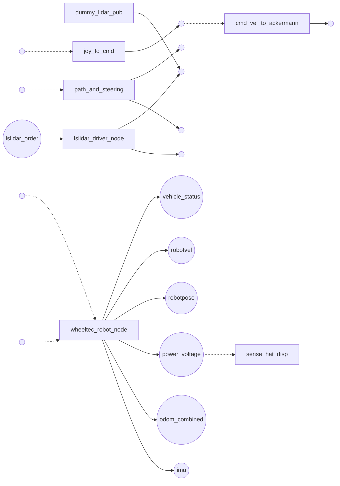

<!-- insight-provider: deterministic -->
<!-- insight-fallback: none -->
> **归档样例说明**：本文是 2026-08-19 由旧版模板生成的 Wheeltec ROS 2 源码专项快照，
> 保留用于追溯，不能代表当前 Wiki 的通用内容骨架。Wheeltec 工程本身存在 package、launch、
> ROS API 与 route 证据，因此本文的 ROS 内容属于工程证据，而不是默认假设。当前生成器会先
> 描述目标主机、运行时和 Application/CLI 软件栈；没有 ROS 证据时不会生成 ROS 专节、ROS
> 关键未知项或 ROS 图采集要求。当前结构见[中文 README](../../README.md#第一阶段自主适配)。

# 机器人 Wiki：wheeltec_validation

> 面向接手、启动和排障的工程视图。完整原始观测保留在同次发现的机器 JSON 中。
> “静态发现”和“启发式推断”均不等于运行或物理验证。本文可由总工持续修正。

## 全栈摘要

| 项目 | 结论 |
|---|---|
| 发现编号 | `disc-20260819T051243-b42e7235` |
| 技术状态 | `PARTIAL` |
| 发现模式/置信度 | `DOC_PROBE` / `LOW` |
| 兼容性判断 | PARTIAL |
| 工程应用/辅助产物 | 15 / 0 |
| 在线 ROS 图 | 0 节点、0 Topics |
| 待确认/警告 | 38 / 46 |

### 当前证据边界

- 证据优先级：构建/部署产物 → 文档/launch → 只读 probe。
- 源码只补充主证据缺口；静态字符串不能证明接口一定在运行。
- 未归属静态接口：5 项；不会静默分配给无源文件证据的程序。
- 尚未确定的关键项：底盘驱动模型, 最大线速度, 最大角速度, ROS 发行版, RMW, ROS Domain ID。
- operation candidate 仅表示可能适用，不表示 adapter 已生成或操作已验证。

### 需要优先复核的启发式发现

> 以下内容是带依据的推断，不是事实提升；完成“验证方式”后才能转为工程结论。

| 类别 | 推断 | 置信度/来源 | 依据 | 验证方式 |
|---|---|---:|---|---|
| ARCHITECTURE | 本次没有观测到在线 ROS 节点，静态接口不能视为运行拓扑。 | MEDIUM/DETERMINISTIC_RULE | ROS probe returned no online nodes | 在正确的 ROS 环境、RMW 和 Domain ID 下启动系统后重新执行只读探测。 |
| SAFETY | 发现运动相关接口或命名，但程序被标记为不可运动；在确认前按可能运动处理：cmd_vel_to_ackermann, joint_state_publisher, joy_to_cmd, wheeltec_robot_node | MEDIUM/DETERMINISTIC_RULE | motion-related endpoint/name, motion_possible=false | 审查发布方向和控制调用，在受控环境中验证实际副作用与失联行为。 |

## 与上次发现的差异

尚无可验证的同机器人基线；本次结果将作为后续比较基线。

## 启动与健康检查

> 自动发现尚不能保证启动顺序、关机步骤和健康阈值；空白项需要总工补充。

| 项目 | 当前发现 | 验证状态 |
|---|---|---|
| 启动入口 | dummy_lidar_pub, joy_to_cmd, path_and_steering, wheeltec_robot_node, usb_cam_node_exe, ekf_node, foxglove_bridge, joint_state_publisher, joy_node, robot_state_publisher, static_transform_publisher | 静态未验证 |
| 启动顺序 | declared by C:\Users\zarch\Desktop\adapt-validation-data\wheeltec_drivers\lslidar_driver\launch\dummy_publisher.launch.py, declared by C:\Users\zarch\Desktop\adapt-validation-data\wheeltec_drivers\turn_on_wheeltec_robot\launch\turn_on_wheeltec_robot.launch.py, declared by C:\Users\zarch\Desktop\adapt-validation-data\wheeltec_drivers\turn_on_wheeltec_robot\launch\turn_on_wheeltec_robot.launch.py, declared by C:\Users\zarch\Desktop\adapt-validation-data\wheeltec_drivers\turn_on_wheeltec_robot\launch\base_serial.launch.py, declared by C:\Users\zarch\Desktop\adapt-validation-data\wheeltec_drivers\usb_cam_launcher\launch\usb_cam_a.launch.py, declared by C:\Users\zarch\Desktop\adapt-validation-data\wheeltec_drivers\usb_cam_launcher\launch\usb_cam_b.launch.py, declared by C:\Users\zarch\Desktop\adapt-validation-data\wheeltec_drivers\turn_on_wheeltec_robot\launch\turn_on_wheeltec_robot.launch.py, declared by C:\Users\zarch\Desktop\adapt-validation-data\wheeltec_drivers\lslidar_driver\launch\dummy_publisher.launch.py, 另有 7 项 | 待确认 |
| 停止方式 | 未获取 | 待确认 |
| 健康检查 | 未获取 | 待确认 |
| 在线节点 | 未获取 | 运行时观测 |

## 硬件与机器人规格

| 项目 | 期望/声明 | 实际发现 |
|---|---|---|
| 计算平台 | auto_discover | unknown |
| CPU 架构 | auto_discover | amd64 |
| 驱动模型 | unresolved | 未从确定性证据提升 |
| 最大线速度 | unknown m/s | 未从确定性证据提升 |
| 最大角速度 | unknown rad/s | 未从确定性证据提升 |

### URDF 结构与语义

- Base link：`base_link`
- Footprint：[[0.195, 0.055], [0.195, -0.055], [-0.035, -0.055], [-0.035, 0.055]]
- 车体尺寸：230 × 110 × 50 mm
- 整车包络：230 × 185 × 65 mm
- 车轮：4 个；半径=32.5 mm；宽度=25 mm
- 轮距：160 mm；轴距：140 mm；离地间隙：15 mm
- 已声明质量：unknown kg；覆盖 link：unknown/5
- Links（5）：base_link, left_front_link, left_wheel_link, right_front_link, right_wheel_link
- 未解析语义：geometry.hard_max_linear_velocity_mps, geometry.hard_max_angular_velocity_radps, platform.drive_model

URDF 关节明细（4 项）

#### Joints

| Joint | 类型 | Parent → Child | Axis | Limits |
|---|---|---|---|---|
| left_wheel_joint | continuous | base_link → left_wheel_link | 0 1 0 | {} |
| right_wheel_joint | continuous | base_link → right_wheel_link | 0 1 0 | {} |
| left_front_joint | continuous | base_link → left_front_link | 0 1 0 | {} |
| right_front_joint | continuous | base_link → right_front_link | 0 1 0 | {} |

### 硬件组件

> `/dev/video*`、input 和 ISP 节点是操作系统接口，不自动等同于物理传感器。

| 组件 | 类型 | 型号/驱动 | 接口或位置 | 采用信息 |
|---|---|---|---|---|
| 未获取 | 未获取 | 未获取 | 未获取 | 未获取 |

### 设备接口归并

> 仅凭稳定序列号/拓扑归并物理设备；驱动启发式只会降级内部端点，不会提升物理身份。

| 分类 | 归并依据 | 操作系统端点 |
|---|---|---|
| 未获取设备端点 | 无 | 无 |

### 控制与仿真声明

- Transmissions：未获取
- ros2_control：未获取
- Gazebo：未获取
- 主机设备节点：0 个（原始清单见机器报告）
- 硬件总线：未获取

## 主机与软件栈

| 项目 | 发现值 |
|---|---|
| 主机名 | dev_cozy |
| 操作系统 | Windows 10 |
| ROS 发行版 | unknown |
| RMW | unknown |
| ROS Domain ID | unknown |

### 可用工具

| 工具 | 状态 | 版本证据 |
|---|---:|---|
| cmake | unavailable | 未获取 |
| colcon | unavailable | 未获取 |
| docker | unavailable | 未获取 |
| gcc | unavailable | 未获取 |
| git | available | git version 2.52.0.windows.1 |
| python3 | unavailable | 未获取 |
| ros2 | unavailable | 未获取 |

## 应用程序与启动拓扑

> 只在正文列出有 launch、显式入口、源码入口或通信证据的工程应用。
> 构建 hook、CMake 探测文件和 ROSIDL 生成库已从正文降级为统计，不视为机器人应用。

| 应用/入口 | 包或启动证据 | 主要接口（已去重） | 风险提示 | 证据状态 |
|---|---|---|---|---|
| `dummy_lidar_pub` | 包=lslidar_driver；节点=未获取；条件=未获取；默认参数=未获取；包含=未获取；证据=lslidar_driver/launch/dummy_publisher.launch.py；状态=`STATIC_UNVERIFIED` | 出=<symbol:scan_topic>；入=未获取 | R0 | 静态/MEDIUM（含符号候选） |
| `joy_to_cmd` | 包=turn_on_wheeltec_robot；节点=未获取；条件=未获取；默认参数=camera=true, carto_slam=false, 另有 3 项；包含=base_serial.launch.py, robot_mode_description.launch.py, 另有 1 项；证据=turn_on_wheeltec_robot/launch/turn_on_wheeltec_robot.launch.py；状态=`STATIC_UNVERIFIED` | 出=<symbol:cmd_vel_topic_>；入=<symbol:joy_topic_> | 需安全复核（发现运动线索） | 静态/MEDIUM（含符号候选） |
| `path_and_steering` | 包=turn_on_wheeltec_robot；节点=未获取；条件=未获取；默认参数=camera=true, carto_slam=false, 另有 3 项；包含=base_serial.launch.py, robot_mode_description.launch.py, 另有 1 项；证据=turn_on_wheeltec_robot/launch/turn_on_wheeltec_robot.launch.py；状态=`STATIC_UNVERIFIED` | 出=<symbol:marker_topic>, <symbol:path_topic>；入=<symbol:cmd_topic> | R0 | 静态/MEDIUM（含符号候选） |
| `wheeltec_robot_node` | 包=turn_on_wheeltec_robot；节点=未获取；条件=未获取；默认参数=akmcar=false；包含=未获取；证据=turn_on_wheeltec_robot/launch/base_serial.launch.py；状态=`STATIC_UNVERIFIED` | 出=imu, odom_combined, power_voltage, robotpose, 另有 2 项；入=<symbol:akm_cmd_vel>, <symbol:cmd_vel> | 需安全复核（发现运动线索） | 静态/MEDIUM（含符号候选） |
| `usb_cam_node_exe` | 包=usb_cam；节点=未获取；条件=未获取；默认参数=未获取；包含=未获取；证据=usb_cam_launcher/launch/usb_cam_a.launch.py, usb_cam_launcher/launch/usb_cam_b.launch.py；状态=`STATIC_UNVERIFIED` | 未发现 ROS 接口 | R0 | 静态/MEDIUM |
| `ekf_node` | 包=robot_localization；节点=未获取；条件=未获取；默认参数=camera=true, carto_slam=false, 另有 3 项；包含=base_serial.launch.py, robot_mode_description.launch.py, 另有 1 项；证据=turn_on_wheeltec_robot/launch/turn_on_wheeltec_robot.launch.py；状态=`STATIC_UNVERIFIED` | 未发现 ROS 接口 | R0 | 静态/MEDIUM |
| `foxglove_bridge` | 包=foxglove_bridge；节点=未获取；条件=未获取；默认参数=camera=true, carto_slam=false, 另有 3 项；包含=base_serial.launch.py, robot_mode_description.launch.py, 另有 1 项；证据=lslidar_driver/launch/dummy_publisher.launch.py, turn_on_wheeltec_robot/launch/turn_on_wheeltec_robot.launch.py；状态=`STATIC_UNVERIFIED` | 未发现 ROS 接口 | R0 | 静态/MEDIUM |
| `joint_state_publisher` | 包=joint_state_publisher；节点=joint_state_publisher；条件=未获取；默认参数=camera=true, carto_slam=false, 另有 3 项；包含=base_serial.launch.py, robot_mode_description.launch.py, 另有 1 项；证据=turn_on_wheeltec_robot/launch/turn_on_wheeltec_robot.launch.py；状态=`STATIC_UNVERIFIED` | 未发现 ROS 接口 | 需安全复核（发现运动线索） | 静态/MEDIUM |
| `joy_node` | 包=joy；节点=未获取；条件=未获取；默认参数=camera=true, carto_slam=false, 另有 3 项；包含=base_serial.launch.py, robot_mode_description.launch.py, 另有 1 项；证据=turn_on_wheeltec_robot/launch/turn_on_wheeltec_robot.launch.py；状态=`STATIC_UNVERIFIED` | 未发现 ROS 接口 | R0 | 静态/MEDIUM |
| `robot_state_publisher` | 包=robot_state_publisher；节点=robot_state_publisher；条件=未获取；默认参数=未获取；包含=未获取；证据=turn_on_wheeltec_robot/launch/robot_mode_description.launch.py；状态=`STATIC_UNVERIFIED` | 未发现 ROS 接口 | R0 | 静态/MEDIUM |
| `static_transform_publisher` | 包=tf2_ros；节点=base_to_camera, base_to_gyro, base_to_laser, 另有 2 项；条件=未获取；默认参数=camera=true, carto_slam=false, 另有 3 项；包含=base_serial.launch.py, robot_mode_description.launch.py, 另有 1 项；证据=lslidar_driver/launch/dummy_publisher.launch.py, turn_on_wheeltec_robot/launch/robot_mode_description.launch.py, 另有 1 项；状态=`STATIC_UNVERIFIED` | 未发现 ROS 接口 | R0 | 静态/MEDIUM |
| `cmd_vel_to_ackermann` | 入口=cmd_vel_to_ackermann | 出=<symbol:ackermann_cmd_topic_>；入=<symbol:cmd_vel_topic_> | 需安全复核（发现运动线索） | 静态/LOW（含符号候选） |
| `lslidar_driver_node` | 入口=lslidar_driver_node | 出=<symbol:pointcloud_topic>, <symbol:scan_topic>；入=lslidar_order | R0 | 静态/LOW（含符号候选） |
| `sense_hat_disp` | 入口=sense_hat_disp | 出=未获取；入=power_voltage | R0 | 静态/LOW |
| `parameter_node` | 入口=parameter_node | 未发现 ROS 接口 | R0 | 静态/LOW |

### 未归属的静态接口

> 已发现接口调用，但入口、构建 target 或安装声明不足以确认所属程序。这些候选不会进入程序拓扑，需通过构建声明或在线图核对。

| 角色 | 名称/表达式 | 类型 | 源文件 |
|---|---|---|---|
| publisher | /ackermann_cmd | AckermannDriveStamped | turn_on_wheeltec_robot/scripts/cmd_vel_to_ackermann_drive.py |
| publisher | cmd_vel | Twist | udp_joystick_ros/scripts/control_vehicle.py |
| service | set_capture | std_srvs::srv::SetBool | usb_cam_launcher/src/usb_cam_node.cpp |
| subscriber | cmd_vel | Twist | turn_on_wheeltec_robot/scripts/cmd_vel_to_ackermann_drive.py |
| subscriber | image_raw | Image | usb_cam_launcher/scripts/show_image.py |

## ROS 与通信拓扑

- 在线节点：未获取
- Topics：未获取
- Services：未获取
- Actions：未获取

> 本次没有在线节点证据；以下关系若存在，仅为静态候选，不代表真实运行拓扑。

## 工程操作候选

> 这里只展示本机发现到的 canonical operation 候选，不展示完整产品 registry。
> 候选表示“可能适用”，不表示已绑定、可调用或已验证；运动类操作在验证前按高风险处理。

| 操作 | 工程含义 | 访问/风险 | 发现依据 | 状态 |
|---|---|---|---|---|
| `app.camera.snapshot` | Capture or reference one bounded frame from a selected camera stream. | read/R0 | semantic://sensor/front_camera/image | 发现但未验证 |
| `app.teleop.velocity` | Submit a bounded planar base velocity command in base_link coordinates. | write/R3 | semantic://actuator/base/velocity_command | 发现但未验证 |

## 依赖、差异与未知项

| 获取方式 | 数量 | 示例 |
|---|---:|---|
| 需人工或外部资料 | 35 | dependency resolution unknown: ros:ackermann_msgs, dependency resolution unknown: ros:ament_cmake, dependency resolution unknown: ros:ament_index_cpp, 另有 32 项 |
| 可启发式推断，需确认 | 2 | dependency resolution unknown: ros:geometry_msgs, dependency resolution unknown: ros:tf2_geometry_msgs |
| 需启动后观测 | 1 | dependency resolution unknown: ros:rosidl_default_runtime |

- 缺失依赖：未获取
- 冲突依赖：未获取
- 兼容性差异：未获取

### 警告

- ros:ackermann_msgs: no readable ament prefixes are available
- ros:ament_cmake: no readable ament prefixes are available
- ros:ament_copyright: no readable ament prefixes are available
- ros:ament_flake8: no readable ament prefixes are available
- ros:ament_index_cpp: no readable ament prefixes are available
- ros:ament_lint_auto: no readable ament prefixes are available
- ros:ament_lint_common: no readable ament prefixes are available
- ros:ament_pep257: no readable ament prefixes are available
- ros:boost: no readable ament prefixes are available
- ros:builtin_interfaces: no readable ament prefixes are available
- ros:diagnostic_updater: no readable ament prefixes are available
- ros:foxglove_bridge: no readable ament prefixes are available
- ros:geometry_msgs: no readable ament prefixes are available
- ros:joint_state_publisher: no readable ament prefixes are available
- ros:joy: no readable ament prefixes are available
- ros:libpcap: no readable ament prefixes are available
- ros:libpcl-all-dev: no readable ament prefixes are available
- ros:libpcl-all: no readable ament prefixes are available
- ros:lslidar_driver: no readable ament prefixes are available
- ros:lslidar_msgs: no readable ament prefixes are available
- 另有 26 条，见机器报告。

## 总工维护建议

1. 启动、停止、健康检查、急停和失联行为。
2. ROS 发行版/RMW/Domain、启动顺序和在线节点基线。
3. 物理设备与 `/dev/*`、驱动、固件和标定文件的映射。
4. 速度/负载/关节安全限制及其来源和验证日期。
5. 版本基线、日志位置、已知故障、负责人和恢复步骤。

## 自动发现附录说明

- 本 Wiki 保留工程结论、关键证据和可行动缺口，不复制完整 registry。
- 完整 executable、文件哈希、原始设备节点、重复接口候选和依赖 ID 保留在同次发现的 JSON/active discovery 报告中。
- 启发式洞察可由确定性规则或 Adapt Agent skill 生成，但必须携带依据、置信度和验证方式，且不得提升为已验证事实。

维护方式：直接编辑本 Markdown；机器证据不会因 Wiki 编辑而改变。下一次发现会生成新版本，旧版本可用于追溯。
