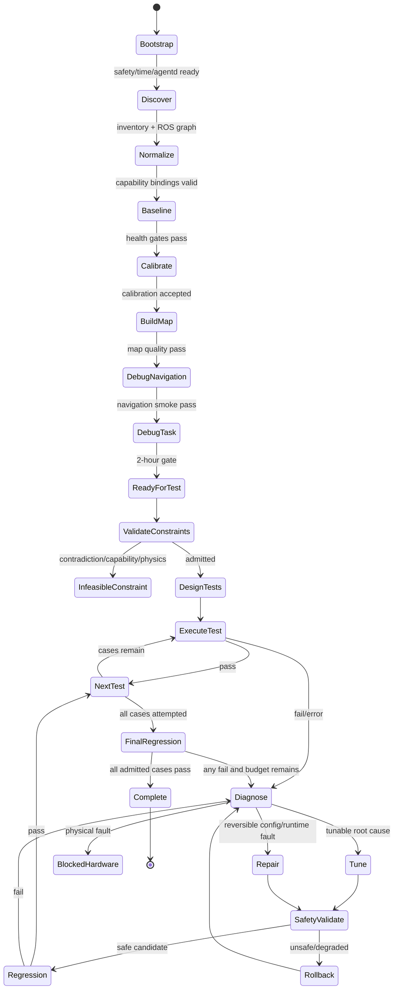

# Robot Debugging Agent：6 小时双异构小车自主调试与测试 Demo 工程规格

> 状态：Draft v0.1
> 目标读者：机器人平台、算法、测试、Agent/Skill、CLI 工具开发团队
> 背景文档：[robot_debugging_agent_mvp.md](robot_debugging_agent_mvp.md)

## 0. 结论与范围修正

原 MVP 文档的核心是“结构化观测 + 主动诊断”，自动化等级约为 Level 1～2；本 Demo 要求 Agent 在真机上完成环境构建、导航调试、应用闭环调试、自动调参、测试设计、测试执行和回归，实际已经进入受安全约束的 Level 4～5。

因此，Demo 不能只实现一组只读诊断工具，还必须补齐：

1. **硬件能力归一化**：两台车可以不同，但必须通过同一套 capability/CLI schema 暴露能力。
2. **带事务的写操作**：参数修改、节点重启、控制器切换都必须可预检、快照、提交和回滚。
3. **物理安全内核**：Agent 不得绕过急停、速度/加速度上限、地理围栏、碰撞监控和命令看门狗。
4. **闭环证据系统**：本体、外部感知和应用预测在统一时钟下形成可计算的自监督信号。
5. **约束编译与测试 Oracle**：把外部用户输入转成可执行测试和明确的 pass/fail 判据。
6. **安全调优器**：在参数边界、依赖关系、风险等级和回归门禁内自动搜索。

“所有测试用例 pass”必须精确定义为：

- 用户约束先经过语法、安全性、能力和物理可行性检查；
- 不可满足、互相矛盾或超出硬件能力的约束，进入 `INFEASIBLE_CONSTRAINT`，不得偷偷放宽，也不得生成一个注定失败的真机用例；
- 所有被正式接纳（admitted）的测试用例必须在最终冻结参数集上通过；
- 被跳过、降级、未执行、Oracle 不确定都不等于 pass；
- 若 6 小时内仍有已接纳用例不通过，Demo 结论就是未达标，而不是改写判据。

## 1. Demo 的可验收定义

### 1.1 输入前提

每台车由平台方提供：

- 可用的硬件、Linux、ROS 2、应用四层 CLI adapter；
- 唯一 `robot_id`、硬件清单、可测量的车体外形和驱动类型；
- 已安装但不要求已调好的统一应用栈；
- 独立急停、人工安全员、隔离测试场和充电方案；
- 外部感知至少一种：顶视相机、UWB、Vicon、AprilTag 基准或已标定固定相机；
- 可用于验收的环境几何、禁行区和任务点定义；
- 允许写入的参数白名单、硬参数安全边界和可回滚的基线配置。

“相同软件栈”不应理解为两个机器人使用同一个二进制驱动，而应理解为：

```text
Agent / Skills / Test DSL / Tuning Engine / State Graph     完全相同
                         │
                canonical CLI schema                       完全相同
                         │
          capability manifest + vendor adapter             可不同
                         │
        HW / Linux / ROS / Application implementation      可不同
```

上层只依赖语义能力，例如 `base.velocity_command`、`pose.estimate`、`range_scan.2d`，不依赖 `/dev/ttyUSB0`、某厂商 SDK 或固定 topic 名。

更严格的验收规则是：

- Agent、Skill、constraint/test DSL、metric/Oracle 实现使用相同 source revision 和 schema version；
- application/ROS 公共组件使用相同 source revision；本 Demo 的 CPU 基线统一为 ARM64，使用同一 ARM64 应用构建产物和 digest；
- vendor driver、kernel module、device config 和 adapter 允许不同；
- 几何、标定、动力学和算法参数值允许 per-robot，不要求用一套数值硬套两台车；
- adapter 之上的代码禁止出现 `if robot_id == ...`，差异只能通过 capability 和 canonical parameter binding 表达；
- 两台车必须通过同一套 CLI conformance tests，包含单位、frame、时间戳、错误码、副作用和回滚语义。

部署基线统一为 **ARM64 + Ubuntu 22.04 + ROS 2 Humble**，当前支持 Jetson Orin、RK3588 和 Raspberry Pi 4/5。发布单元是一份公共 ARM64 安装包，内含同一 Agent/runtime、canonical CLI、state graph、测试与调优引擎、`robot_use` 客户端、schema 以及两车 profile；同一份归档分别复制到两台车上，安装时按车体结构与传感器显式选择且只激活本机 profile，SoC 由启动发现服务识别。三类平台的 BSP、vendor driver、设备 binding、标定和参数允许不同，但必须封装在 canonical adapter/profile 以下，上层禁止按 SoC 分叉业务逻辑。两台车仍各自运行完整实例，本机密钥引用、日志、录像和 artifact 不共享。跨车 scheduler/直播控制台只是可选上层，失联不得破坏车端安全内核、记录与停止能力。

### 1.2 六小时时间线

| 时间 | 阶段 | 必须产出 |
|---|---|---|
| 00:00–00:15 | 启动与安全握手 | 两车在线、急停验证、运动租约、时间同步状态、初始快照 |
| 00:15–00:35 | 自动发现与归一化 | capability manifest、设备/进程/ROS/TF 图、topic 语义绑定 |
| 00:35–01:05 | 标定与基线 | 轮径/轴距/符号/缩放、IMU bias、传感器外参/时延检查、基线健康报告 |
| 01:05–01:35 | 环境构建 | 地图、地图质量报告、外部基准对齐、可导航区/禁行区 |
| 01:35–02:00 | 导航和操作调试 | 基线任务成功、首个冻结候选参数集、2 小时阶段报告 |
| 02:00–02:20 | 约束接纳与测试设计 | 约束编译报告、覆盖矩阵、用例、Oracle、风险分级、执行计划 |
| 02:20–05:30 | 自动测试—诊断—调优—回归 | 逐轮证据、失败归因、调参 trial、回滚记录、回归结果 |
| 05:30–06:00 | 冻结与最终验收 | 两车在冻结配置上跑最终套件，所有 admitted cases pass，生成报告和回放包 |

两台车应并行执行独立 session。任何共享外部感知、场地或网络资源必须由 scheduler 加锁，不能让两台车互相污染测试结果。

### 1.3 最低验收门槛

建议在直播前固定以下最低门槛；用户约束只能更严格，不能临场降低：

- 零碰撞、零越界、零急停触发；近碰事件为零或不超过预先声明阈值；
- 地图完整率、重影率、闭环一致性达到预设阈值；
- N 个导航目标全部成功，包含直线、转弯、窄通道、动态障碍和恢复场景；
- 终点位置/航向误差、耗时、路径效率、最小净空满足约束；
- 车体命令与实测速度跟踪误差、超调、稳态误差、振荡、jerk 满足约束；
- 任务操作（如靠站、对接、触发载荷或可选机械臂动作）达到成功判据；
- 传感器短时退化、节点重启、CPU/网络压力等允许的故障注入后能安全失败或恢复；
- 两车使用同一份测试 DSL 和 Agent skill，仅 capability manifest 与参数值不同；
- 最终参数集、原始证据、状态图、每次变更和 pass/fail 均可追溯。

### 1.4 非目标

- 不刷写 MCU/电机固件，不自动修改安全 PLC 或急停逻辑；
- 不允许 Agent 自行扩大硬件安全包络；
- 不承诺修复机械损坏、接线错误或无法通过软件补偿的硬件能力不足；
- 不以“LLM 看视频觉得可以”作为唯一 Oracle；
- 不在最终验收过程中继续调参。

### 1.5 需求追踪

| 原始需求 | 本规格落点 |
|---|---|
| 完整详尽 CLI 清单 | 第 2～4 节；四层 CLI、公共控制面、capability manifest |
| 调用链/state graph/通信协议 | 第 5～8、12 节；图 schema、状态机、事务、DSL、event/gRPC 约定 |
| 自主调优和算法参数 | 第 9～10 节；canonical registry、参数全集、搜索与 commit gate |
| 应用闭环自监督及抽象 CLI | 第 11 节；原始信号、一致性规则、label、12 个闭环原语 |

## 2. 统一 CLI 契约

### 2.1 命令形态

所有现有 CLI tool 需要包装为同一命令入口，示意如下：

```bash
robotctl --robot robot_a <layer> <resource> <verb> \
  --input request.json --output json
```

必须支持：

- `--request-id`：幂等键；相同键与相同输入不得重复产生副作用；
- `--deadline`：绝对时间或超时；
- `--dry-run`：只做能力、参数、依赖、安全预检；
- `--lease-id`：写操作、运动操作和场地占用的租约；
- `--if-version`：乐观并发控制，避免覆盖其他写入；
- `--reason`：记录 Agent 的假设、证据和变更原因；
- `--session-id`、`--trial-id`、`--test-case-id`：全链路关联；
- stdout 只输出一个 JSON result envelope；人类日志写 stderr；
- 长任务返回 `job_id`，通过 `job status/watch/cancel` 获取进展。

### 2.2 请求与响应 envelope

```json
{
  "schema_version": "robot-agent/v1",
  "request_id": "req_01J...",
  "session_id": "sess_demo_001",
  "robot_id": "robot_a",
  "timestamp": "2026-08-15T10:00:00.123456+08:00",
  "deadline": "2026-08-15T10:00:10+08:00",
  "actor": {"type": "agent", "id": "debug-agent"},
  "operation": "ros.topic.measure",
  "mode": "execute",
  "lease_id": null,
  "if_version": 37,
  "reason": "Verify lidar freshness before mapping",
  "input": {
    "topic": "semantic://sensor/front_lidar/scan",
    "window_s": 10,
    "metrics": ["rate", "jitter", "age", "loss", "bandwidth"]
  }
}
```

```json
{
  "schema_version": "robot-agent/v1",
  "request_id": "req_01J...",
  "status": "SUCCEEDED",
  "started_at": "2026-08-15T10:00:00.130000+08:00",
  "finished_at": "2026-08-15T10:00:10.130000+08:00",
  "robot_id": "robot_a",
  "graph_version": 38,
  "data": {
    "topic": "/scan",
    "samples": 100,
    "rate_hz": 9.98,
    "jitter_ms_p95": 1.7,
    "message_age_ms_p95": 14.2,
    "estimated_loss_ratio": 0.001,
    "bandwidth_mbps": 2.8
  },
  "evidence_refs": ["artifact://sess_demo_001/telemetry/scan_1000_1010"],
  "events": ["event://evt_01J..."],
  "warnings": [],
  "error": null
}
```

失败响应必须使用稳定的机器可判定错误码：

```text
INVALID_ARGUMENT | NOT_FOUND | UNSUPPORTED_CAPABILITY | PRECONDITION_FAILED
LEASE_REQUIRED | LEASE_EXPIRED | SAFETY_INTERLOCK | CONFLICT | TIMEOUT
DEVICE_ERROR | PROCESS_ERROR | ROS_ERROR | ORACLE_UNCERTAIN | INFEASIBLE
INTERNAL_ERROR
```

每个错误都要包含 `retryable`、`details`、`evidence_refs` 和建议的 `next_operations`；不得只返回自由文本。

### 2.3 安全等级与授权

| 等级 | 含义 | 示例 | Agent 权限 |
|---|---|---|---|
| R0 | 纯读取 | inventory、topic rate、日志查询 | 自动 |
| R1 | 可逆、非运动写入 | 开始录包、打开 debug 指标 | 自动，需 session |
| R2 | 会影响服务但不直接运动 | 改白名单参数、重启节点 | 自动，需事务和回滚 |
| R3 | 受控运动/故障注入 | 发送速度、运行导航、限时断开 topic | 需运动租约、安全门和 watchdog |
| R4 | 可能改变硬安全边界或不可恢复 | 提高硬速度上限、刷固件、关闭急停 | Demo 中禁止 |

### 2.4 参数注册表 schema

所有可调参数必须先注册，不允许 Agent 通过通用 `param set` 猜测名称和值：

```yaml
key: nav.local_costmap.inflation.radius
binding:
  robot_a: /local_costmap/local_costmap:inflation_layer.inflation_radius
  robot_b: /local_costmap/local_costmap:inflation.inflation_radius
type: float
unit: m
source: software_default
current: 0.55
hard_bounds: [0.36, 1.20]
search_bounds: [0.45, 0.90]
step_hint: 0.02
mutable: lifecycle_restart
risk: R2
scope: per_robot
dependencies:
  - "value >= robot.geometry.inscribed_radius"
  - "nav.controller.cost_scaling_distance <= value"
objectives: [collision_risk, clearance, path_feasibility, travel_time]
rollback: parameter_snapshot
provenance: nav2_adapter
```

`hard_bounds` 由人或制造商签名，Agent 只能缩小 `search_bounds`，不能扩大 `hard_bounds`。

## 3. 完整 CLI 清单

下面是本 Demo 所需的 canonical surface。厂商 CLI、shell、ROS 2 CLI 和 SDK 都应隐藏在 adapter 后。标记为“写”的命令必须遵守上一节的事务、安全和租约约定。

### 3.1 Hardware 层：`robotctl hw ...`

| 命令 | 风险 | 关键输入 | 结构化输出/用途 |
|---|---:|---|---|
| `hw inventory scan` | R0 | bus/vendor filter | 设备、序列号、固件、bus path、driver、能力、在线状态 |
| `hw inventory diff` | R0 | baseline snapshot | 新增、消失、替换和枚举路径变化 |
| `hw capability export` | R0 | device/all | 传感器/执行器语义能力、单位、范围、采样率、可写配置 |
| `hw device identify` | R0 | device ref | vendor/product/serial/physical port 与稳定 logical id |
| `hw device health` | R0 | device ref, window | error counter、温度、电压、reset、数据新鲜度、health score |
| `hw device reset` | R2 | device ref, method | 软 reset/USB rebind/电源域 reset 的 job 和恢复结果 |
| `hw device configure` | R2 | profile/patch | 预检后的设备配置、旧值、新值、是否需重启 |
| `hw firmware version` | R0 | device ref | 固件/bootloader/协议版本；Demo 禁止写固件 |
| `hw bus list` | R0 | usb/pci/i2c/can/ethernet | bus topology、带宽、速率、连接关系 |
| `hw bus stats` | R0 | bus ref, window | errors、retries、drops、utilization、link resets |
| `hw can inspect` | R0 | interface, filters | bitrate、bus state、error frames、bus load、节点心跳 |
| `hw serial inspect` | R0 | logical port | baud/parity、framing/CRC error、吞吐、占用进程 |
| `hw gpio read` | R0 | named line | 电平、debounce 后状态、时间戳 |
| `hw power status` | R0 | domain/device | 电源域、voltage/current/power、brownout、cycle count |
| `hw power cycle` | R3 | signed domain | 仅白名单非安全关键设备；结果含重新枚举证据 |
| `hw battery status` | R0 | battery id | SOC/SOH、电压、电流、温度、剩余时长、告警 |
| `hw thermal status` | R0 | device/all | 温度、降频、风扇、热阈值余量 |
| `hw clock status` | R0 | device | 时钟源、offset、drift、sync lock、PPS/PTP 状态 |
| `hw sensor list` | R0 | modality filter | camera/lidar/imu/range/encoder/bumper 等列表及 semantic URI |
| `hw sensor info` | R0 | sensor ref | 型号、frame、profile、量程、分辨率、FOV、时间戳来源 |
| `hw sensor stream start` | R1 | sensor/profile | 临时采集 job、实际 profile 和 artifact ref |
| `hw sensor stream stop` | R1 | job id | 完成状态、样本数、丢帧数 |
| `hw sensor measure` | R0 | sensor, window, metrics | rate/jitter/age/loss/noise/saturation/invalid ratio |
| `hw sensor self-test` | R1 | sensor, test type | 厂商自检、暗帧/静止/回环测试及原始证据 |
| `hw sensor profile get` | R0 | sensor | 当前分辨率、fps、曝光、增益、回波模式等 |
| `hw sensor profile set` | R2 | sensor, patch | 白名单配置变更和可恢复旧 profile |
| `hw calibration get` | R0 | sensor/actuator | intrinsic/extrinsic/bias/scale/time offset 与 covariance |
| `hw calibration capture` | R3 | procedure, target | 标定 episode、质量条件和原始数据 |
| `hw calibration solve` | R1 | dataset, model | 候选标定、残差、退化方向、不确定度；不直接写入 |
| `hw calibration apply` | R2 | candidate id | 事务应用、验证、版本、回滚 token |
| `hw calibration validate` | R0/R3 | calibration id, procedure | 静态或低速真机验证结果 |
| `hw actuator list` | R0 | type filter | motor/steering/brake/gripper/dock 等能力和 semantic URI |
| `hw actuator info` | R0 | actuator | command/state interface、limits、反馈、故障码 |
| `hw actuator state` | R0 | actuator, window | position/velocity/effort/current/temp/error/enable state |
| `hw actuator enable` | R3 | actuator group | 安全条件、租约、实际 enable 状态 |
| `hw actuator disable` | R3 | actuator group | 零命令、disable 确认、制动状态 |
| `hw actuator test` | R3 | signed low-energy waveform | 受限 step/ramp/chirp，命令与反馈 artifact |
| `hw actuator stop` | R3 | group/all | 最高优先级停止并确认速度归零 |
| `hw encoder measure` | R0 | encoder, window | ticks、position、velocity、direction、drop/wrap |
| `hw motor diagnostics` | R0 | motor, window | current tracking、stall、slip、thermal、driver fault |
| `hw estop status` | R0 | all channels | 每路急停、safety relay、reset eligibility |
| `hw bumper status` | R0 | all | 触点状态、latched event、时间戳 |

Hardware adapter 必须把物理设备绑定到稳定的 semantic URI，例如：

```text
semantic://sensor/front_lidar
semantic://sensor/imu
semantic://actuator/base/left_wheel
semantic://safety/estop
```

同一台设备换了 `/dev` 编号或 NIC 名时，semantic URI 不应变化。

### 3.2 Linux 层：`robotctl linux ...`

| 命令 | 风险 | 关键输入 | 结构化输出/用途 |
|---|---:|---|---|
| `linux host inspect` | R0 | none | OS/kernel/arch/CPU/GPU/RAM、hostname、boot id、uptime |
| `linux host capability` | R0 | none | realtime、PTP、GPU runtime、container、trace 能力 |
| `linux env snapshot` | R0 | process/session | ROS/domain/RMW/library path、locale、关键环境变量的脱敏值 |
| `linux process list` | R0 | filters | pid、exe、cmd hash、state、parent、cgroup、resources |
| `linux process inspect` | R0 | pid/logical service | threads、fds、sockets、limits、scheduler、affinity、restarts |
| `linux process signal` | R2 | process, allowed signal | 仅白名单 signal；结果含退出/存活状态 |
| `linux service list` | R0 | systemd/container | unit、state、restart count、dependency |
| `linux service start` | R2 | unit | job、健康探针和日志证据 |
| `linux service stop` | R2 | unit | graceful timeout、最终状态 |
| `linux service restart` | R2 | unit | 前快照、重启、warm-up、health gate、rollback |
| `linux service logs` | R0 | unit, time/query | 结构化日志事件、severity、cursor、artifact ref |
| `linux resource snapshot` | R0 | host/process/cgroup | CPU/RAM/swap/disk IO/network/GPU/temperature |
| `linux resource watch` | R1 | target, metrics, rate, duration | 时序 artifact 和阈值事件 |
| `linux cpu inspect` | R0 | none | core utilization、freq、throttle、load、irq、steal |
| `linux memory inspect` | R0 | none | used/available/cache/swap/OOM history/pressure |
| `linux storage inspect` | R0 | paths/devices | capacity、inode、IO latency、errors、mount options |
| `linux gpu inspect` | R0 | device/process | driver/runtime、util、memory、temperature、power、ECC |
| `linux network list` | R0 | namespace | interface、MAC/IP/MTU/link speed/duplex/route |
| `linux network link` | R0 | interface | carrier、negotiated speed、flaps、driver/firmware |
| `linux network stats` | R0 | interface, window | rx/tx、drops/errors、pps/bps、queue、retransmit |
| `linux network route` | R0 | destination | selected route、gateway、source、metric |
| `linux network ping` | R0 | target, count | RTT/loss/jitter |
| `linux network port-probe` | R0 | udp/tcp endpoint | reachability、response、socket error |
| `linux network throughput-test` | R3 | approved peer, cap | 有带宽上限的吞吐/抖动测试，避免挤占控制流量 |
| `linux network capture` | R1 | interface/BPF/duration/cap | 限大小 pcap、flow summary、脱敏策略 |
| `linux network qos inspect` | R0 | interface | qdisc/class/drop/priority 映射 |
| `linux socket list` | R0 | pid/protocol | local/remote、state、queue、drops、owner |
| `linux time status` | R0 | none | system/monotonic/ROS time、NTP/PTP offset/drift/stratum |
| `linux time sync` | R2 | approved source | 同步 job；运动中禁止 step clock，只允许安全策略内 slew |
| `linux device list` | R0 | subsystem | udev path、driver、permissions、owner、stable symlink |
| `linux device events` | R0/R1 | subsystem, window/watch | add/remove/reset/link/permission 事件 |
| `linux kernel query` | R0 | time/severity/subsystem | dmesg/journal 结构化事件，不返回无界全文 |
| `linux kernel module` | R0 | module/device | version、params、taint、bound devices |
| `linux trace start` | R1 | approved probe set | perf/eBPF/LTTng/strace 白名单 trace job |
| `linux trace stop` | R1 | job id | trace artifact、drop count、overhead |
| `linux container list` | R0 | runtime | image digest、state、health、resources、network |
| `linux container inspect` | R0 | container | mounts、devices、env hash、capabilities、limits |
| `linux container restart` | R2 | container | 与 service restart 相同的事务门禁 |
| `linux package manifest` | R0 | scope | apt/pip/ROS overlay/driver 版本及 digest |
| `linux file checksum` | R0 | allowlisted path | digest、size、mtime、owner |
| `linux config snapshot` | R0 | registered config set | 配置内容的版本化 artifact；敏感值脱敏 |
| `linux config plan` | R0 | patch | schema、依赖、安全、diff、restart impact |
| `linux config apply` | R2 | approved plan | 原子写入、验证、restart、rollback token |
| `linux fault inject` | R3 | registered fault, bound, duration | CPU/网络/进程故障，仅测试白名单和自动撤销 |
| `linux fault clear` | R3 | injection id/all session | 清除并验证恢复 |

禁止暴露无约束的 `shell.exec` 给调试 Agent。确有必要时，应把新命令固化为带 schema、allowlist、超时和输出上限的 adapter，再纳入注册表。

### 3.3 ROS 层：`robotctl ros ...`

| 命令 | 风险 | 关键输入 | 结构化输出/用途 |
|---|---:|---|---|
| `ros domain inspect` | R0 | domain/namespace | ROS distro、RMW、domain id、discovery/security 状态 |
| `ros doctor run` | R0 | check set | 安装、网络、RMW、版本、环境问题清单 |
| `ros graph snapshot` | R0 | namespace/include-hidden | node/topic/service/action/component 与连接边 |
| `ros graph diff` | R0 | two versions | publisher/subscriber/node/QoS/lifecycle 变化 |
| `ros graph watch` | R1 | filters, duration | 图变化事件流和 artifact |
| `ros node list` | R0 | namespace | node、host/process/container、lifecycle、health |
| `ros node inspect` | R0 | node | publishers/subscribers/services/actions/params/callback hints |
| `ros node health` | R0 | node, window | liveliness、heartbeat、callback latency、restart、diagnostics |
| `ros node logs` | R0 | node, time/query | ROS 日志事件和 source location |
| `ros node restart` | R2 | registered node | lifecycle 优先；否则 service/container 事务重启 |
| `ros lifecycle get` | R0 | node | current state、available transitions |
| `ros lifecycle transition` | R2 | node, transition | precondition、transition result、post-health |
| `ros component list` | R0 | container | loaded components、plugin、state |
| `ros component reload` | R2 | component | plan/snapshot/unload/load/health/rollback |
| `ros topic list` | R0 | type/namespace | topic/type/counts/semantic binding |
| `ros topic inspect` | R0 | topic | type、publishers/subscribers、endpoint QoS、type hash |
| `ros topic measure` | R0 | topic, window, metrics | hz/jitter/age/loss/bandwidth/size/stamp skew/duplicate |
| `ros topic sample` | R0 | topic, fields, count/rate | 限量结构化样本；大消息返回摘要和 artifact |
| `ros topic schema` | R0 | topic/type | 字段、单位 annotation、header/stamp/frame 位置 |
| `ros topic qos-check` | R0 | topic/endpoints | reliability/durability/history/depth/deadline/liveliness 兼容性 |
| `ros topic trace` | R1 | source/sink/window | publish→DDS→take→callback 的时延分解 |
| `ros topic publish` | R3 | registered fixture topic, message/rate | 仅测试命名空间、schema 校验、自动停止 |
| `ros service list` | R0 | namespace | service/type/provider |
| `ros service inspect` | R0 | service | schema、provider、availability、latency history |
| `ros service call` | R2/R3 | registered service, request | 风险由服务注册表决定，响应和副作用证据 |
| `ros action list` | R0 | namespace | action/type/server/status |
| `ros action inspect` | R0 | action | goal/feedback/result schema、server、active goals |
| `ros action send` | R3 | registered action, goal | goal id、feedback stream、result、cancel handle |
| `ros action status` | R0 | goal id | state、progress、last feedback、age |
| `ros action cancel` | R3 | goal id | cancel ack、最终状态、运动停止确认 |
| `ros param schema` | R0 | node | 参数类型、descriptor、range、dynamic/read-only、canonical binding |
| `ros param list` | R0 | node/prefix | name/type/current/source |
| `ros param get` | R0 | canonical/raw key | value、version、descriptor、provenance |
| `ros param plan` | R0 | registered patch | type/range/dependency/risk/restart/diff 校验 |
| `ros param apply` | R2 | plan id | atomic batch、post-check、rollback token |
| `ros param rollback` | R2 | token/version | 恢复、restart、health gate |
| `ros param snapshot` | R0 | node set | versioned YAML/JSON artifact 和 digest |
| `ros param diff` | R0 | snapshots/current | semantic diff、影响组件 |
| `ros interface show` | R0 | type | msg/srv/action schema |
| `ros tf snapshot` | R0 | time | frame tree、publisher、static/dynamic、latest transform |
| `ros tf lookup` | R0 | target/source/time | transform、age、interpolation/extrapolation、covariance 若可用 |
| `ros tf measure` | R0 | edge/path, window | rate、age、jitter、jump、drift、availability |
| `ros tf validate` | R0 | required frames/rules | missing parent、multiple parent、loop、stale、跳变、命名冲突 |
| `ros diagnostics snapshot` | R0 | filters | diagnostic status、key-value、staleness、source |
| `ros diagnostics watch` | R1 | filters, duration | 状态变化事件和 artifact |
| `ros bag record` | R1 | semantic topic set, duration/size | bag job、QoS override、drop count、storage artifact |
| `ros bag stop` | R1 | job id | 完整性和索引状态 |
| `ros bag inspect` | R0 | bag ref | topics/count/time/QoS/serialization/drop/clock |
| `ros bag validate` | R0 | bag ref, requirements | 必需流、频率、时间单调性、可回放性 |
| `ros bag play` | R2 | bag, namespace/rate/clock | 隔离 replay session，禁止直接驱动真实 actuator |
| `ros bag trim` | R1 | bag, time/topic filters | incident window artifact |
| `ros launch plan` | R0 | package/file/args/profile | resolved nodes/params/remaps/env 与冲突 |
| `ros launch start` | R2 | plan id | job、节点清单、warm-up health |
| `ros launch status` | R0 | job/session | process/node/lifecycle 状态 |
| `ros launch stop` | R2 | job/session | orderly stop 和资源清理 |
| `ros control hardware` | R0 | controller manager | hardware component、interface、claim、state |
| `ros control controllers` | R0 | controller manager | controller、type、state、claimed interfaces、fallback |
| `ros control switch-plan` | R0 | activate/deactivate | interface conflict、availability、安全影响 |
| `ros control switch` | R3 | plan id | 原子切换、post-state、rollback |
| `ros control metrics` | R0 | controller, window | update rate/jitter/deadline miss、command/state error |
| `ros tracing start` | R1 | ROS tracepoint profile | callback/executor/DDS trace job |
| `ros tracing stop` | R1 | job id | artifact、event/drop count、overhead |
| `ros fault inject` | R3 | registered ROS fault | drop/delay/rate-limit/restart/QoS mismatch，自动撤销 |
| `ros fault clear` | R3 | injection id | 恢复图和 topic 健康确认 |

### 3.4 Application 层：`robotctl app ...`

Application 层只暴露稳定的任务语义；Nav2、MoveIt、厂商导航栈或自研节点的差异由 adapter 消化。

| 命令 | 风险 | 关键输入 | 结构化输出/用途 |
|---|---:|---|---|
| `app robot discover` | R0 | none | drive model、geometry、sensors、actuators、navigation/task abilities |
| `app robot manifest` | R0 | none/version | 完整 capability、semantic binding、limits、adapter versions |
| `app robot readiness` | R0 | mission type | 按任务检查 sensors/TF/localization/control/safety |
| `app geometry get` | R0 | base/tool | footprint、wheelbase、wheel radius、turning radius、tool envelope |
| `app geometry validate` | R3 | low-speed procedure | 外部基准下验证 footprint/kinematics，不自动缩小安全外形 |
| `app safety status` | R0 | none | estop、bumper、collision monitor、geofence、lease、watchdog |
| `app safety policy` | R0 | none | signed hard limits、soft limits、zones、stop conditions |
| `app safety arm` | R3 | mission/lease | 所有 interlock 通过后进入可运动状态 |
| `app safety disarm` | R3 | reason | 取消目标、零命令、disable/hold 的确认 |
| `app safety stop` | R3 | reason | 最高优先级应用停止；不能替代硬急停 |
| `app safety zone set` | R2 | signed map zones | geofence/keepout/speed zone 的事务更新 |
| `app teleop velocity` | R3 | bounded twist/duration | 标定/测试用受限命令，watchdog 到期自动归零 |
| `app localization configure` | R2 | profile/patch | localizer/sensor fusion 配置事务 |
| `app localization initialize` | R3 | pose/distribution/source | 初始位姿和收敛结果 |
| `app localization status` | R0 | window | pose/covariance/mode/innovation/jump/relocalization |
| `app localization reset` | R2/R3 | strategy | 静止条件、reset、重收敛验证 |
| `app mapping start` | R3 | mode/area/sensor/profile | mapping episode 和探索策略 |
| `app mapping status` | R0 | episode | coverage、entropy、loop closure、pose graph、remaining frontier |
| `app mapping pause` | R3 | episode | 暂停和静止确认 |
| `app mapping resume` | R3 | episode | readiness gate 后恢复 |
| `app mapping finish` | R3 | episode | 优化、保存候选地图、质量报告 |
| `app map inspect` | R0 | map id | bounds/resolution/occupancy/unknown/topology/version |
| `app map quality` | R0 | map id, external reference/rules | coverage、重影、墙厚、断裂、漂移、回环残差 |
| `app map activate` | R2 | map id | 版本切换、localization reset、rollback |
| `app perception status` | R0 | pipeline | input/output rate、latency、drops、confidence、resource |
| `app perception obstacles` | R0 | ROI/time | 障碍物/自由空间、frame、uncertainty、source |
| `app perception tracks` | R0 | class/ROI/time | track id、pose/velocity/covariance/age |
| `app perception quality` | R0 | episode/oracle | precision/recall、geometry residual、temporal consistency |
| `app planner plan` | R0 | start/goal/constraints | path、cost、clearance、feasibility、planner debug |
| `app planner validate` | R0 | path, current world | footprint collision、curvature、zone、staleness |
| `app navigation goal` | R3 | pose/route/behavior constraints | goal id、feedback、trajectory artifact |
| `app navigation route` | R3 | waypoints/route | 多点任务与每段结果 |
| `app navigation status` | R0 | goal id/current | BT state、progress、distance、ETA、recoveries、stall |
| `app navigation cancel` | R3 | goal id | cancel、速度归零、最终 pose |
| `app navigation metrics` | R0 | goal/episode | success、error、time、length、efficiency、clearance、smoothness |
| `app navigation recovery` | R3 | registered behavior | clear/spin/backup/wait/relocalize，受边界与碰撞门控 |
| `app controller status` | R0 | base/tool | mode、command、feedback、saturation、tracking error |
| `app controller excite` | R3 | bounded waveform/axis | 自动辨识用低能量 step/ramp/chirp |
| `app controller identify` | R1 | episode/model | deadband、delay、gain、time constant、friction/slip 候选模型 |
| `app task list` | R0 | capability filter | 支持的 dock/pick/drop/trigger/inspect 等任务模板 |
| `app task plan` | R0 | task spec | 前置条件、步骤、资源锁、Oracle、超时、恢复 |
| `app task run` | R3 | plan id | task id、逐步 feedback、证据和结果 |
| `app task status` | R0 | task id | 当前步骤、进度、阻塞、last evidence |
| `app task cancel` | R3 | task id | 安全取消和资源释放 |
| `app task metrics` | R0 | task/episode | success、耗时、重试、精度、接触/载荷指标 |
| `app constraint validate` | R0 | constraint document | 语法、矛盾、能力、安全和可行性报告 |
| `app test design` | R1 | admitted constraints, coverage policy | test suite、Oracle、风险、预计耗时、资源计划 |
| `app test inspect` | R0 | suite/case | 完整步骤、断言、参数、seed、fixture |
| `app test run` | R3 | suite/case, config version | run id、实时 verdict、evidence |
| `app test abort` | R3 | run id/reason | 停止、安全恢复、部分结果 |
| `app test result` | R0 | run/suite | PASS/FAIL/ERROR/ORACLE_UNCERTAIN，不合并概念 |
| `app test report` | R1 | suite/session | HTML/JSON/JUnit、覆盖、失败、配置、artifact links |
| `app fault list` | R0 | capability/risk | 可注入故障、边界、恢复方法 |
| `app fault inject` | R3 | fault spec | 注入 id、自动清除时间、安全 guard |
| `app fault clear` | R3 | injection id | 清除及恢复证据 |
| `app tune manifest` | R0 | subsystem | 参数、边界、依赖、风险、objectives、mutability |
| `app tune baseline` | R1 | config version, suite | baseline 指标和可重复性 |
| `app tune propose` | R1 | search state/budget | 候选参数、预期收益、风险和理由 |
| `app tune trial` | R3 | candidate, test subset | 事务应用→执行→评分→回滚/保留 |
| `app tune commit` | R2 | candidate id | 生成冻结版本、完整回归门禁 |
| `app tune rollback` | R2 | config version/token | 回退和健康验证 |
| `app episode start` | R1/R3 | type/context/topic profile | 统一时间窗、metadata、recording job |
| `app episode stop` | R1/R3 | episode id | 完整性、索引、派生指标 job |
| `app evidence snapshot` | R0/R1 | semantic signals/time window | 同步证据包 |
| `app robot-use start` | R1 | execution/test、camera、policy、poll profile | 启动本体相机 GPT 多模态语义监督模式和连续录像 |
| `app robot-use status` | R0 | mode/execution id | 模式、录像、最近轮询、in-flight request、监督 verdict、budget |
| `app robot-use poll` | R1 | time window、task contract、telemetry profile | 按时间抽帧并请求一次 GPT 结构化监督结果 |
| `app robot-use trigger` | R1 | state event/manual/checkpoint | 在任务状态转换、检查点或人工请求时立即执行监督 |
| `app robot-use review` | R1 | episode/time range、coarse-to-fine profile | 对历史录像做粗到细回溯并定位首次异常区间 |
| `app robot-use result` | R0 | request/review id | NORMAL/SUSPECTED_FAILURE/FAILURE/UNKNOWN、异常区间和证据 |
| `app robot-use stop` | R1 | mode id、archive policy | 停止轮询，完成录像归档和末次结果验证 |
| `app consistency evaluate` | R0 | rule set, episode/window | 自监督残差、置信度、异常区间 |
| `app oracle register` | R1 | external/onboard oracle spec | 坐标、时钟、质量、优先级和可用性 |
| `app oracle status` | R0 | oracle id | freshness、coverage、uncertainty、health |
| `app label generate` | R1 | episode/rules | 自监督 label、质量和 provenance |

### 3.5 跨层控制面：`robotctl session/job/graph/artifact/config/lease`

这些不是第五个机器人运行层，而是确保四层工具可编排、可恢复、可审计的公共控制面。

| 命令 | 用途 |
|---|---|
| `session create/inspect/close` | 建立 Demo、机器人、时钟、artifact、policy 的顶级作用域 |
| `session checkpoint/restore` | 保存状态图、配置版本、活动 job、测试进度；只恢复软件状态，不恢复物理位置 |
| `job status/watch/cancel/list` | 统一管理 mapping、bag、test、tuning 等长任务 |
| `lease acquire/renew/release/inspect` | 机器人运动、场地、传感器、配置和外部 fixture 的互斥租约 |
| `graph snapshot/query/path/diff/watch` | 查询实时 Robot State Graph 及因果/依赖路径 |
| `artifact put/get/list/verify/pin` | 内容寻址保存 bag、日志、地图、trace、报告、配置 |
| `config snapshot/plan/apply/commit/rollback/diff` | 跨 ROS/Linux/设备的统一配置事务 |
| `event append/query/subscribe` | 事件溯源，支持 incident 和因果对齐 |
| `policy inspect/evaluate` | 执行前评估安全、授权、资源和变更策略 |
| `scheduler submit/status/cancel` | 两车、场地和外部感知资源调度 |

## 4. Capability Manifest：异构硬件复用的核心

每台车启动时输出同一 schema 的 manifest：

```yaml
schema_version: robot-capability/v1
robot_id: robot_a
adapter_version: 0.4.0
platform:
  drive_model: differential
  base_command: semantic://actuator/base/twist
  base_feedback: semantic://state/base/odometry
geometry:
  footprint_m: [[0.31, 0.23], [0.31, -0.23], [-0.29, -0.23], [-0.29, 0.23]]
  inscribed_radius_m: 0.23
  circumscribed_radius_m: 0.386
  hard_max_linear_velocity_mps: 0.8
  hard_max_angular_velocity_radps: 1.5
sensors:
  range_primary:
    semantic_uri: semantic://sensor/front_lidar/scan
    modality: lidar_2d
    ros_binding: /scan
    frame: laser_link
    nominal_rate_hz: 10
  imu:
    semantic_uri: semantic://sensor/imu
    ros_binding: /imu/data
    frame: imu_link
external_oracles:
  - type: overhead_camera_apriltag
    pose_binding: semantic://oracle/external_pose
features:
  mapping_2d: true
  navigation_2d: true
  docking: true
  manipulation: false
mutations:
  runtime_parameters: true
  lifecycle_restart: true
  firmware_update: false
limitations:
  can_translate_sideways: false
```

Skill 在执行前只检查 capability，不用 `robot_id` 写分支。真正无法归一化的能力必须显式为 `false` 或 `unsupported_reason`，不能返回空数据冒充成功。

## 5. Robot State Graph

### 5.1 节点类型

| 类别 | 节点 |
|---|---|
| 物理 | `Robot`、`Host`、`PowerDomain`、`Bus`、`Device`、`Sensor`、`Actuator`、`SafetyChannel`、`ExternalOracle` |
| Linux | `Process`、`Thread`、`ServiceUnit`、`Container`、`Socket`、`NIC`、`FileConfig`、`KernelEvent` |
| ROS | `Domain`、`Participant`、`Node`、`LifecycleState`、`Publisher`、`Subscriber`、`Topic`、`Service`、`Action`、`Controller`、`HardwareInterface`、`TFFrame` |
| 应用 | `Pipeline`、`Algorithm`、`Map`、`PoseEstimate`、`Costmap`、`Path`、`Goal`、`Task`、`SafetyPolicy` |
| 实验 | `Session`、`Episode`、`Constraint`、`TestSuite`、`TestCase`、`TestRun`、`Trial`、`ParameterSet`、`Metric`、`OracleVerdict` |
| 诊断 | `Symptom`、`Hypothesis`、`Evidence`、`Incident`、`RootCause`、`ActionRecommendation` |
| 制品 | `Artifact`、`ConfigVersion`、`SoftwareVersion`、`CalibrationVersion`、`Report` |

每个节点最少包含：

```json
{
  "id": "rosnode://robot_a/navigation/controller_server",
  "type": "Node",
  "robot_id": "robot_a",
  "valid_from": "2026-08-15T10:00:00.000000+08:00",
  "valid_to": null,
  "observed_at": "2026-08-15T10:00:01.000000+08:00",
  "version": 42,
  "health": "HEALTHY",
  "confidence": 0.99,
  "properties": {},
  "provenance": ["operation://ros.graph.snapshot/req_01J..."]
}
```

### 5.2 边类型

| 边 | 含义/例子 |
|---|---|
| `CONTAINS` | Robot contains Host；Host contains NIC |
| `CONNECTED_TO` | lidar connected_to eth1/USB bus |
| `POWERED_BY` | sensor powered_by power domain |
| `RUNS_ON` | process/node runs_on host/container |
| `HOSTED_BY` | ROS node hosted_by process/component container |
| `PUBLISHES` / `SUBSCRIBES` | node 与 topic endpoint |
| `OFFERS` / `CALLS` | service/action 关系 |
| `TRANSFORMS_TO` | TF frame parent-child |
| `COMMANDS` / `FEEDBACK_FROM` | controller 与 actuator/state interface |
| `DEPENDS_ON` | perception depends_on camera；navigation depends_on localization |
| `CONFIGURED_BY` | algorithm configured_by ParameterSet/ConfigVersion |
| `CALIBRATED_BY` | sensor/actuator calibrated_by CalibrationVersion |
| `PRODUCES` / `CONSUMES` | pipeline、artifact、metric 数据流 |
| `OBSERVES` | external oracle observes robot/target |
| `VALIDATES` | OracleVerdict validates TestRun/Metric |
| `VIOLATES` / `SATISFIES` | TestRun 与 Constraint |
| `EVIDENCE_FOR` / `EVIDENCE_AGAINST` | Evidence 与 Hypothesis |
| `CAUSED_BY` | Incident/Metric anomaly 与 RootCause |
| `PRECEDES` / `CORRELATED_WITH` | 时间和统计关系；不得自动等同因果 |
| `DERIVED_FROM` | 指标/label/地图来自哪些原始 artifact |
| `SUPERSEDES` / `ROLLS_BACK_TO` | 配置和标定版本关系 |

### 5.3 数据链示例

```text
Sensor(front_lidar)
  ─CONNECTED_TO→ NIC(eth1)
  ─POWERED_BY→ PowerDomain(sensor_24v)
  ←READS_FROM─ Process(lidar_driver)
  ←HOSTED_BY─ Node(lidar_node)
  ─PUBLISHES→ Topic(semantic://sensor/front_lidar/scan)
  ─CONSUMED_BY→ Algorithm(scan_matcher)
  ─PRODUCES→ PoseEstimate(localization)
  ─CONSUMED_BY→ Algorithm(local_costmap)
  ─CONSUMED_BY→ Algorithm(controller)
  ─COMMANDS→ Actuator(base)
  ─FEEDBACK_FROM→ Topic(semantic://state/base/odometry)
  ─VALIDATED_BY→ ExternalOracle(overhead_pose)
```

当导航失败时，调查 Agent 先用 `graph path` 枚举 goal 到物理设备的依赖路径，再选择信息增益最高且风险最低的观测工具。

### 5.4 图更新协议

图采用 snapshot + event-sourced patch：

```json
{
  "event_id": "evt_01J...",
  "event_type": "graph.patch",
  "robot_id": "robot_a",
  "session_id": "sess_demo_001",
  "event_time": "2026-08-15T10:32:07.412000+08:00",
  "ingest_time": "2026-08-15T10:32:07.430000+08:00",
  "source": "linux.device.events",
  "source_clock": "CLOCK_MONOTONIC_RAW",
  "clock_uncertainty_ms": 0.4,
  "sequence": 8812,
  "base_graph_version": 1204,
  "operations": [
    {
      "op": "replace",
      "path": "/nodes/device:front_lidar/properties/link_state",
      "value": "DOWN"
    },
    {
      "op": "add",
      "path": "/edges/-",
      "value": {
        "type": "EVIDENCE_FOR",
        "from": "event://evt_01J...",
        "to": "hypothesis://lidar_link_failure"
      }
    }
  ]
}
```

必须同时保存 `event_time` 与 `ingest_time`，并记录时钟不确定度。跨模态对齐时使用 `[event_time - uncertainty, event_time + uncertainty]`，不能假装所有信号严格同步。

## 6. Agent 调用链与状态机

### 6.1 顶层状态机



任何可运动状态都可异步转移到 `SAFETY_STOP`。解除 `SAFETY_STOP` 必须重新完成安全员确认、现场清空、急停 reset、定位有效、命令通道归零和新运动租约；不能从原动作断点直接继续。

### 6.2 每个测试失败的调查循环

```text
1. Freeze incident window
   episode.stop + evidence.snapshot + graph.snapshot + config.snapshot
2. Classify verdict
   assertion failure / infrastructure error / oracle uncertain / safety stop
3. Generate hypotheses from dependency graph
4. Rank next diagnostics by:
   expected_information_gain / (time_cost + safety_risk + interference)
5. Collect evidence without changing state when possible
6. Update hypothesis probabilities and contradiction set
7. Establish root cause only when:
   causal mechanism + time order + counterevidence check + reproducibility
8. Select action:
   no-op / retry / config repair / parameter tune / component restart / hardware block
9. Execute change transaction
10. Run narrow reproduction, safety regression, then affected-suite regression
```

根因置信度不能只由 LLM 自评。建议组合：先验 10%、结构依赖 20%、时间一致性 20%、对照/干预 30%、重复性 20%，并输出每项证据。

### 6.3 双车并发调度

每台车拥有独立的 `RobotSession`、配置版本和 tuning search state；公共资源建立独占或共享锁：

```text
Resource                 Lock
robot_a motion           exclusive(robot_a)
robot_b motion           exclusive(robot_b)
test lane 1              exclusive
overhead camera ROI A    shared if non-overlap, otherwise exclusive
wireless stress channel  exclusive
charging station         exclusive
map artifact store       concurrent, content-addressed
```

调度器在 lease 失效、Agent 断连或 watchdog 超时时必须停止运动，不依赖 LLM 发出 stop。

## 7. 写操作的事务和回滚协议

所有配置/参数/组件变更采用两阶段事务：

```text
PLAN
  resolve canonical keys
  → validate schema/range/dependencies
  → evaluate policy/risk
  → compute affected graph
  → snapshot old values + software/graph/physical pose
  → produce plan_id and rollback strategy

APPLY
  acquire config + motion/resource leases
  → force safe stationary state if required
  → apply atomically where supported
  → lifecycle restart/reconfigure
  → warm-up
  → health checks
  → narrow validation
  → COMMIT candidate version or ROLLBACK
```

事务结果至少包含：

- canonical diff 与每台车实际 binding diff；
- before/after 配置 digest；
- 受影响节点、topic、控制器、测试；
- 是否需要静止、重启、重新定位、清 costmap 或重新建图；
- rollback token、回滚验证和已知不可逆副作用；
- 变更原因、支持证据、trial/test id。

以下改动不得在线自动搜索：急停逻辑、硬电流/温度极限、最小安全 footprint、硬速度上限、制动器逻辑、碰撞监控总开关、geofence 总开关、固件和内核驱动。

## 8. 测试约束 DSL 与自动用例设计

### 8.1 约束文档示例

```yaml
schema_version: robot-test-constraint/v1
scope:
  robots: [robot_a, robot_b]
  software_profile: common_stack_v3
environment:
  map: demo_arena
  allowed_zones: [main_lane, narrow_lane, dock_zone]
  forbidden_zones: [audience, cable_area]
  lighting_lux: {min: 100, max: 800}
safety:
  collision_count: {eq: 0}
  near_miss_distance_m: {gte: 0.15}
  max_linear_velocity_mps: {lte: 0.55}
  max_angular_velocity_radps: {lte: 1.2}
navigation:
  goals: [P1, P2, P3, P4]
  position_error_m_p95: {lte: 0.10}
  yaw_error_rad_p95: {lte: 0.12}
  success_rate: {eq: 1.0}
  path_efficiency: {gte: 0.85}
  max_recoveries_per_goal: {lte: 1}
control:
  linear_tracking_rmse_mps: {lte: 0.06}
  yaw_tracking_rmse_radps: {lte: 0.10}
  overshoot_ratio: {lte: 0.10}
  stop_distance_m: {lte: 0.18}
task:
  docking_success_rate: {eq: 1.0}
  docking_pose_error_m: {lte: 0.03}
robustness:
  scenarios:
    - sensor_rate_degrade: {sensor: range_primary, ratio: 0.7, duration_s: 10}
    - restart_node: {semantic_node: localization, while_stationary: true}
statistics:
  repetitions: 3
  seeds: [11, 29, 47]
  flaky_policy: fail
```

### 8.2 约束接纳

`app constraint validate` 按顺序检查：

1. schema、单位、坐标系和时间范围；
2. 内部矛盾，例如最大速度低于任务所需最低速度且又限制完成时间；
3. 两车 capability 是否都支持任务和 Oracle；
4. 是否违反 signed safety policy；
5. 物理可达性，例如窄通道宽度必须大于 footprint + 两侧安全余量；
6. 统计预算能否在剩余时间内完成；
7. Oracle 是否有足够精度区分 pass 与 fail；Oracle 不确定度应显著小于验收阈值。

输出逐条 `ADMITTED | REJECTED | NEEDS_CLARIFICATION`，并给证据。只有全部关键约束 admitted 后才进入测试设计。

### 8.3 自动生成策略

自动测试设计至少覆盖：

- **边界值**：最高/最低允许速度、最窄通道、最小净空、最远目标；
- **等价类**：直线、90°/180° 转弯、曲线、开阔区、狭窄区、不同地面；
- **组合覆盖**：机器人 × 路径类型 × 速度区间 × 障碍类型 × 传感器状态；优先 pairwise，再补高风险三元组合；
- **状态转换**：启动、定位、目标取消、重定位、节点恢复、低电量；
- **故障注入**：仅已注册且可自动清除的 rate drop、delay、node restart、CPU/network pressure；
- **变形测试**：地图/任务旋转或镜像后性能应近似；小幅降速不应降低安全性；同一路径重复结果应稳定；
- **回归选择**：参数影响图决定必须重跑的 suite；共享底层参数变更不得只跑当前失败用例；
- **跨车一致性**：对同一语义约束采用同一 Oracle 和指标定义，但不要求数值参数相同。

### 8.4 Test Case schema

```yaml
id: nav_narrow_dynamic_001
applies_to: [robot_a, robot_b]
preconditions:
  - safety.ready == true
  - localization.quality >= 0.9
  - battery.soc >= 0.35
fixtures:
  map: demo_arena_v7
  start_pose: P1
  external_oracle: overhead_pose
steps:
  - action: app.localization.initialize
    input: {pose: P1}
  - action: app.navigation.goal
    input: {pose: P4, max_speed_mps: 0.45}
  - wait:
      until: navigation.terminal
      timeout_s: 90
assertions:
  - metric: collision_count
    op: eq
    value: 0
    severity: hard
  - metric: min_clearance_m
    op: gte
    value: 0.15
    oracle: fused
  - metric: goal_position_error_m
    op: lte
    value: 0.10
    oracle: external_pose
cleanup:
  - action: app.navigation.cancel
  - action: app.safety.disarm
artifacts: [synced_episode, rosbag, graph_snapshot, config_snapshot, metric_series]
```

### 8.5 Verdict 规则

- `PASS`：所有 hard assertion 有有效 Oracle 且通过；允许的 soft 指标只用于排序，不改变 hard verdict。
- `FAIL`：至少一个 hard assertion 失败；安全 assertion 失败立即终止。
- `ERROR`：测试基础设施、工具或前置条件出错；修复后必须重跑，不能计为 pass。
- `ORACLE_UNCERTAIN`：证据缺失、漂移或不确定度过大；修复 Oracle 后重跑。
- `INFEASIBLE`：只能在用例生成前出现；正式 admitted case 执行后不得改判 infeasible 来规避失败。

## 9. 算法参数暴露清单

### 9.1 暴露原则

参数名使用 canonical key，adapter 再绑定到 Nav2、ros2_control、厂商驱动或自研实现。不同算法插件不存在的参数标为 `unsupported`，不能伪造默认值。

每个参数除值外还必须暴露：`type`、`unit`、`source`、`hard_bounds`、`search_bounds`、`step_hint`、`mutable`、`risk`、`dependencies`、`objectives`、`binding`、`last_changed_by` 和 `config_version`。

来源按可信度排序：

```text
manufacturer/measured geometry
> signed safety policy
> calibrated estimate with covariance
> known-good baseline
> software default
> Agent proposal
```

几何真值和安全值不能为了“测试通过”被调优。举例：真实车宽为 0.46 m 时，不允许把 footprint 改成 0.40 m 来通过窄通道测试。

### 9.2 底盘几何、执行器与里程计

| Canonical key | 单位/类型 | 含义与调优影响 | 风险/依赖 |
|---|---|---|---|
| `base.kinematics.model` | enum | differential/ackermann/omni；决定约束模型 | 测量/只读，不可搜索 |
| `base.geometry.wheel_radius` | m | 轮半径；影响线速度尺度和里程 | R2，需直线外部基准标定 |
| `base.geometry.wheel_separation` | m | 差速轮距；影响角速度尺度 | R2，需旋转外部基准标定 |
| `base.geometry.wheelbase` | m | Ackermann 前后轴距 | R2，物理测量 |
| `base.geometry.track_width` | m | 左右轮距 | R2，物理测量 |
| `base.geometry.steering_offset` | rad | 转向零位 | R2，需静态/圆弧验证 |
| `base.geometry.min_turning_radius` | m | 运动学最小转弯半径 | 不得小于实测能力 |
| `base.odometry.left_radius_multiplier` | ratio | 左轮速度缩放 | 与右轮/直线漂移耦合 |
| `base.odometry.right_radius_multiplier` | ratio | 右轮速度缩放 | 与左轮/直线漂移耦合 |
| `base.odometry.separation_multiplier` | ratio | 角里程缩放 | 用闭环旋转残差标定 |
| `base.encoder.ticks_per_revolution` | count | 编码器分辨率 | 硬件真值，不搜索 |
| `base.encoder.gear_ratio` | ratio | 电机到车轮传动比 | 硬件真值，不搜索 |
| `base.encoder.direction.<wheel>` | ±1 | 编码器符号 | 低速 excite 验证 |
| `base.command.direction.<axis>` | ±1 | 命令符号 | 低速 excite 验证，R3 |
| `base.command.scale.linear` | ratio | 线速度命令缩放 | 与轮径标定区分，避免双重补偿 |
| `base.command.scale.angular` | ratio | 角速度命令缩放 | 与轮距标定区分 |
| `base.command.deadband.linear` | m/s | 克服静摩擦的最小命令 | 太大导致跳变，太小不动 |
| `base.command.deadband.angular` | rad/s | 最小转动命令 | 同上 |
| `base.command.timeout` | s | 无新命令自动停止 | 安全关键，只可缩短或在硬界内调整 |
| `base.limits.velocity.linear.{min,max}` | m/s | 软件速度包络 | 不得超过 signed hard limit |
| `base.limits.velocity.angular.{min,max}` | rad/s | 角速度包络 | 同上 |
| `base.limits.acceleration.linear.{min,max}` | m/s² | 加速/减速限制 | 制动距离与跟踪能力约束 |
| `base.limits.acceleration.angular.{min,max}` | rad/s² | 角加速度限制 | 稳定性/防侧翻/电机能力 |
| `base.limits.jerk.linear.{min,max}` | m/s³ | 线 jerk 限制 | 平滑性与响应速度权衡 |
| `base.limits.jerk.angular.{min,max}` | rad/s³ | 角 jerk 限制 | 同上 |
| `base.feedforward.static.<axis>` | command | 静摩擦前馈 | 由低速辨识，限制在安全范围 |
| `base.feedforward.velocity.<axis>` | command/(unit/s) | 速度前馈系数 | 减少稳态误差 |
| `base.feedforward.acceleration.<axis>` | command/(unit/s²) | 加速度前馈 | 可能放大噪声/冲击 |
| `base.control.kp.<axis>` | implementation unit | 比例增益；过高振荡/超调，过低响应慢 | R2/R3 trial，绑定控制周期 |
| `base.control.ki.<axis>` | implementation unit | 积分增益；消除稳态误差 | 必须有 anti-windup |
| `base.control.kd.<axis>` | implementation unit | 微分增益；增加阻尼但放大噪声 | 与 derivative filter 耦合 |
| `base.control.i_clamp.<axis>` | command | 积分限幅 | 防 windup |
| `base.control.antiwindup_gain.<axis>` | ratio | 回算/条件积分强度 | 与输出饱和联动 |
| `base.control.derivative_filter_hz.<axis>` | Hz | D 项低通截止 | 应低于 Nyquist 且高于控制带宽 |
| `base.control.output_limit.<axis>` | command | 控制输出软限幅 | 不得超硬件/安全限制 |
| `base.control.update_rate` | Hz | 底层控制循环 | 通常需重启；受 CPU 和 sensor rate 限制 |
| `base.model.delay.<axis>` | s | 命令到运动的时延 | 用互相关/step response 估计 |
| `base.model.time_constant.<axis>` | s | 一阶响应时间常数 | 调整 planner/controller horizon |
| `base.slip.longitudinal_scale` | ratio | 纵向打滑补偿 | 地面相关，应带 profile/置信度 |
| `base.slip.yaw_scale` | ratio | 转动打滑补偿 | 地面相关 |
| `base.odom.publish_rate` | Hz | 里程发布频率 | 不得高于有效反馈能力 |
| `base.odom.pose_covariance` | matrix | pose 观测噪声 | 必须由残差估计，不用任意缩小骗融合器 |
| `base.odom.twist_covariance` | matrix | twist 观测噪声 | 同上 |

### 9.3 传感器预处理、内外参与时间

| Canonical key | 单位/类型 | 含义与调优影响 | 风险/依赖 |
|---|---|---|---|
| `sensor.<id>.frame` | string | 语义 frame | 必须存在于 TF，通常只读 |
| `sensor.<id>.extrinsic.translation` | m[3] | 传感器外参平移 | 由标定解和 covariance 支撑 |
| `sensor.<id>.extrinsic.rotation` | quaternion/rpy | 外参旋转 | 同上，不能用导航结果随意过拟合 |
| `sensor.<id>.time_offset` | s | 相对系统时钟 offset | 与运动畸变、融合残差强耦合 |
| `sensor.<id>.timestamp_source` | enum | device/system/ROS/reception | 能力/只读 |
| `sensor.<id>.rate_target` | Hz | 目标采样率 | 受硬件 profile 支持 |
| `sensor.<id>.queue_depth` | count | 输入队列 | 大会增加时延，小会丢帧 |
| `sensor.<id>.drop_policy` | enum | oldest/newest/block | 实时链路通常优先 freshness |
| `sensor.<id>.filter.lowpass_cutoff` | Hz | 低通截止 | 平滑与相位延迟权衡 |
| `sensor.<id>.filter.median_window` | count | 中值滤波窗口 | 过大破坏细节和增加延迟 |
| `lidar.<id>.range.{min,max}` | m | 有效量程 | 不得超过物理可靠范围 |
| `lidar.<id>.angle.{min,max}` | rad | ROI/FOV | 必须覆盖制动距离和转向方向 |
| `lidar.<id>.voxel_leaf_size` | m | 体素降采样 | 大则省算力但丢小障碍 |
| `lidar.<id>.outlier.mean_k` | count | 统计离群邻域 | 与点云密度相关 |
| `lidar.<id>.outlier.stddev_mul` | ratio | 离群阈值 | 小则激进删除 |
| `lidar.<id>.deskew.enabled` | bool | 是否运动去畸变 | 依赖 IMU/odom 和时间同步 |
| `lidar.<id>.deskew.time_offset` | s | 点云与运动参考时差 | 用静态结构重影残差调 |
| `camera.<id>.intrinsics` | fx/fy/cx/cy/distortion | 相机内参 | 标定值，不做在线自由搜索 |
| `camera.<id>.resolution` | px | 输入分辨率 | 精度、FOV、算力/带宽权衡 |
| `camera.<id>.fps` | Hz | 帧率 | 受曝光与带宽制约 |
| `camera.<id>.exposure` | µs | 曝光 | 亮度与运动模糊权衡 |
| `camera.<id>.gain` | dB/ratio | 增益 | 提亮同时增加噪声 |
| `camera.<id>.resize.scale` | ratio | 图像缩放因子 | 必须同步更新内参；不是速度缩放 |
| `camera.<id>.depth.scale` | m/raw_unit | 深度缩放 | 设备标定值，不随意搜索 |
| `depth.<id>.range.{min,max}` | m | 有效深度 | 依据无效率/噪声曲线 |
| `imu.<id>.gyro.bias` | rad/s[3] | 陀螺零偏 | 静止段估计并记录温度 |
| `imu.<id>.accel.bias` | m/s²[3] | 加计零偏 | 静态姿态/多姿态标定 |
| `imu.<id>.gyro.scale` | ratio[3] | 陀螺比例 | 外部旋转基准标定 |
| `imu.<id>.accel.scale` | ratio[3] | 加计比例 | 重力/多姿态标定 |
| `imu.<id>.noise_density` | unit/√Hz | 白噪声 | Allan variance/静止数据 |
| `imu.<id>.random_walk` | unit/√s | bias random walk | 同上 |
| `imu.<id>.orientation_covariance` | matrix | 姿态不确定度 | 根据残差估计 |

### 9.4 定位与状态估计

| Canonical key | 含义 | 调优关系 |
|---|---|---|
| `localization.frequency` | 滤波/定位更新频率 | 不高于最慢关键输入可承受频率，受 CPU 约束 |
| `localization.sensor_timeout` | 输入超时 | 应大于正常 p99 周期且小于任务失效容忍 |
| `localization.transform_tolerance` | TF 未来容忍 | 过大掩盖时延，过小易 extrapolation |
| `localization.process_noise_covariance` | 过程噪声矩阵 | 大则更信观测，小则更信模型；必须看 innovation |
| `localization.initial_estimate_covariance` | 初值协方差 | 与初始化来源精度匹配 |
| `localization.input.<id>.measurement_covariance` | 观测协方差 | 由对外部 Oracle 残差估计，不人为缩小 |
| `localization.input.<id>.differential` | 是否用差分量 | 避免多个绝对源冲突，但会积分漂移 |
| `localization.input.<id>.relative` | 是否以首帧为参考 | 适用于相对里程源 |
| `localization.input.<id>.rejection_threshold` | innovation gate | 太小拒绝有效观测，太大接受 outlier |
| `amcl.alpha1..alpha5` | 里程运动模型噪声 | 分别关联旋转/平移误差；由真实运动残差估计 |
| `amcl.min_particles` / `amcl.max_particles` | 粒子数边界 | 精度/全局恢复与 CPU 权衡 |
| `amcl.pf_err` / `amcl.pf_z` | KLD 采样误差/置信度 | 决定自适应粒子数量 |
| `amcl.update_min_d` / `amcl.update_min_a` | 触发滤波更新的最小位移/转角 | 太大造成 pose 更新滞后 |
| `amcl.resample_interval` | 重采样间隔 | 太频繁粒子贫化，太慢收敛慢 |
| `amcl.transform_tolerance` | map→odom 容忍 | 与端到端时延相关 |
| `amcl.recovery_alpha_fast` / `amcl.recovery_alpha_slow` | 随机恢复动态 | kidnapped robot 恢复速度 |
| `amcl.laser_model_type` | beam/likelihood field | 能力和环境特性选择 |
| `amcl.z_hit/z_short/z_max/z_rand` | 激光观测模型混合权重 | 应归一化并基于残差分布 |
| `amcl.sigma_hit` | 命中高斯标准差 | 地图/雷达噪声与外参影响 |
| `amcl.lambda_short` | 短读数指数参数 | 动态障碍环境相关 |
| `amcl.laser_likelihood_max_dist` | likelihood field 最大距离 | 与地图分辨率/障碍结构耦合 |
| `amcl.max_beams` | 下采样 beam 数 | 精度与计算权衡 |
| `amcl.beam_skip_*` | beam skip 距离/比例/错误阈值 | 动态障碍鲁棒性；需防止忽略真实结构 |

### 9.5 建图与地图质量

| Canonical key | 含义 | 调优关系 |
|---|---|---|
| `mapping.resolution` | 地图栅格分辨率 | 小更精细但耗内存/算力；应小于需分辨障碍尺度 |
| `mapping.update_interval` | 地图发布/更新周期 | freshness 与 CPU/带宽 |
| `mapping.min_travel_distance` | 新 scan 处理最小平移 | 太大漏细节，太小重复/耗算力 |
| `mapping.min_travel_heading` | 新 scan 处理最小转角 | 同上 |
| `mapping.scan_buffer_size` | scan matching buffer | 局部稳定性与内存/旧数据污染 |
| `mapping.scan_buffer_maximum_scan_distance` | 缓存最大空间跨度 | 与环境尺度相关 |
| `mapping.correlation.search_space.dimension` | 平移搜索窗口 | 大更鲁棒但慢 |
| `mapping.correlation.search_space.resolution` | 搜索步长 | 精度/算力 |
| `mapping.correlation.search_space.smear_deviation` | 响应平滑 | 过大降低几何辨识度 |
| `mapping.loop_search_maximum_distance` | 回环候选距离 | 大增加候选和假回环风险 |
| `mapping.loop_match_minimum_chain_size` | 连续匹配链长度 | 大更保守 |
| `mapping.loop_match_minimum_response_coarse/fine` | 粗/细匹配阈值 | 高减少假回环但可能漏回环 |
| `mapping.distance_variance_penalty` | 平移偏离惩罚 | 与 scan matcher 搜索范围耦合 |
| `mapping.angle_variance_penalty` | 旋转偏离惩罚 | 同上 |
| `mapping.fine/coarse_search_angle_offset` | 角搜索范围 | 鲁棒性/计算量 |
| `mapping.minimum_angle_penalty` / `minimum_distance_penalty` | 最小惩罚 | 防止不合理 pose jump |
| `mapping.occupancy.free_threshold` | free 更新阈值 | 影响墙厚和空区清理 |
| `mapping.occupancy.occupied_threshold` | occupied 更新阈值 | 影响障碍连续性 |
| `mapping.optimizer.max_iterations` | 图优化迭代 | 收敛质量/耗时 |
| `mapping.optimizer.loss_function` | robust loss | 抵抗 outlier edge |
| `mapping.optimizer.loss_scale` | robust loss 尺度 | 应匹配残差分布 |

### 9.6 Costmap 与障碍建模

| Canonical key | 单位/类型 | 含义与调优方向 | 关键依赖 |
|---|---|---|---|
| `costmap.global/local.resolution` | m/cell | 越小越精细、计算/内存越高 | 小于待检测障碍尺度；与地图分辨率协调 |
| `costmap.*.update_frequency` | Hz | 障碍更新频率 | 不应明显高于输入有效频率 |
| `costmap.*.publish_frequency` | Hz | 可视化发布频率 | 不影响内部更新；防止误当 update rate |
| `costmap.*.width/height` | m | local window 尺寸 | 至少覆盖预测/制动距离和绕障空间 |
| `costmap.*.rolling_window` | bool | local 随车窗口 | 与 global/local 用途匹配 |
| `costmap.*.transform_tolerance` | s | TF 容忍 | 由 TF age p99 决定，不能无限放大 |
| `costmap.*.footprint` | polygon | 实际碰撞外形 | 测量真值，禁止调小；不同车独立 |
| `costmap.*.footprint_padding` | m | footprint 额外安全垫 | 安全/可通过性权衡，不得突破 policy 下限 |
| `costmap.*.track_unknown_space` | bool | 是否保留 unknown | global planner 与探索策略相关 |
| `costmap.*.unknown_cost_value` | 0..255 | unknown 编码 | adapter 保证语义一致 |
| `obstacle.<source>.topic` | URI | 观测源 | 使用 semantic binding |
| `obstacle.<source>.data_type` | enum | LaserScan/PointCloud/Range | capability 决定 |
| `obstacle.<source>.marking/clearing` | bool | 标障/清障 | clearing 需要可靠 raytrace |
| `obstacle.<source>.obstacle_min/max_range` | m | 标障范围 | 在传感器可靠范围和制动距离内 |
| `obstacle.<source>.raytrace_min/max_range` | m | 清障射线范围 | 通常 max 略大于 obstacle max，但不超可靠量程 |
| `obstacle.<source>.min/max_obstacle_height` | m | 高度过滤 | 与底盘/环境障碍高度定义一致 |
| `obstacle.<source>.observation_persistence` | s | 观测保留 | 大可抗丢帧但留下 ghost obstacle |
| `obstacle.<source>.expected_update_rate` | Hz/s | stale 判定 | 依据实测 p99 周期 |
| `obstacle.<source>.inf_is_valid` | bool | inf 是否表示 free | 由驱动语义决定 |
| `obstacle.combination_method` | enum | overwrite/max/max-without-unknown | 多层融合语义 |
| `voxel.origin_z` | m | 体素起点 | 对齐地面/传感器 |
| `voxel.z_resolution` | m | 垂直分辨率 | 与障碍高度尺度相关 |
| `voxel.z_voxels` | count | 垂直层数 | 覆盖所需高度，受内存约束 |
| `voxel.mark_threshold` | count | 标记 occupied 的 voxel 数 | 噪声/小障碍敏感度 |
| `voxel.unknown_threshold` | count | unknown 判据 | 与 z_voxels 耦合 |
| `inflation.enabled` | bool | 膨胀层开关 | Demo 中不可为绕过障碍而关闭 |
| `inflation.radius` | m | 障碍影响半径；不是“系数” | 必须 ≥ inscribed radius，通常覆盖期望安全净空 |
| `inflation.cost_scaling_factor` | 1/m | 指数衰减因子；值越大，代价下降越快、远处障碍影响越弱 | 与 controller obstacle critic、RPP cost scaling 联调 |
| `inflation.inflate_unknown` | bool | unknown 整体按 lethal 膨胀 | 探索/保守导航权衡 |
| `inflation.inflate_around_unknown` | bool | unknown 边界周围膨胀 | 同上 |
| `costmap.filter.keepout.enabled` | bool | 禁行区 | safety policy 控制，不得自动关闭 |
| `costmap.filter.speed.scale` | ratio | 区域限速缩放因子 | 0..1；这是速度缩放，不是 inflation scaling |

### 9.7 全局规划与路径平滑

| Canonical key | 含义 | 调优关系 |
|---|---|---|
| `planner.algorithm` | NavFn/Smac2D/Hybrid/Lattice/other | 根据 drive model 和环境选择，不在 trial 中频繁切换 |
| `planner.expected_frequency` | 期望规划频率 | 作为健康阈值，不等于控制频率 |
| `planner.tolerance` | 无法到精确目标时容忍半径 | 必须不大于测试 goal tolerance，否则“规划成功”不等于任务成功 |
| `planner.allow_unknown` | 是否穿越 unknown | 与地图/安全策略一致 |
| `planner.max_iterations` | 搜索迭代上限 | 可行性与超时权衡 |
| `planner.max_planning_time` | 规划时限 | 任务超时的子预算 |
| `planner.downsample_costmap` / `downsampling_factor` | 降采样开关/倍数 | 速度提高但窄障碍细节丢失 |
| `planner.motion_model` | 2D/Hybrid motion model | 必须匹配 differential/ackermann/omni |
| `planner.angle_quantization_bins` | 航向离散数 | Hybrid 精度/搜索量 |
| `planner.minimum_turning_radius` | 最小转弯半径 | 不得小于实车实测值 |
| `planner.reverse_penalty` | 倒车惩罚 | 太高导致无解，太低出现不必要倒车 |
| `planner.change_penalty` | 转向方向切换惩罚 | 抑制摆动 |
| `planner.non_straight_penalty` | 非直线惩罚 | 路径长度与可操控性 |
| `planner.cost_penalty` | costmap 代价权重 | clearance 与路径长度权衡 |
| `planner.retrospective_penalty` | 延后扩展惩罚 | 搜索效率/最优性 |
| `planner.analytic_expansion_ratio` | 解析扩展频率 | Hybrid 搜索速度 |
| `planner.analytic_expansion_max_length` | 解析连接最大长度 | 必须与 turning radius/障碍密度协调 |
| `planner.cache_obstacle_heuristic` | 缓存障碍启发 | 静态地图复用性能 |
| `planner.lookup_table_size` | 运动学查表尺度 | 至少覆盖所需转弯结构 |
| `planner.smoother.max_iterations` | 平滑迭代 | 耗时/收敛 |
| `planner.smoother.w_smooth` | 平滑项权重 | 太高切角/偏离原路径 |
| `planner.smoother.w_data` | 数据保真权重 | 太高路径不够平滑 |
| `planner.smoother.tolerance` | 收敛容忍 | 计算/精度 |
| `planner.smoother.refinement` | 递归细化开关/次数 | 平滑质量/耗时 |
| `planner.path_resolution` | 路径点间距 | controller lookahead/index 与 MPPI path handler 依赖 |

### 9.8 局部控制器：公共运动边界

| Canonical key | 单位 | 含义 |
|---|---|---|
| `controller.frequency` | Hz | 局部控制循环频率；必须满足实际 compute deadline |
| `controller.velocity.linear.{min,max}` | m/s | 控制器采样/输出速度范围，受 base hard limit 限制 |
| `controller.velocity.lateral.{min,max}` | m/s | 仅 omni；其他模型必须为 0/unsupported |
| `controller.velocity.angular.{min,max}` | rad/s | 角速度范围 |
| `controller.speed.xy.{min,max}` | m/s | 平面合速度界 |
| `controller.acceleration.{x,y,theta}` | SI | 最大加速度 |
| `controller.deceleration.{x,y,theta}` | SI | 最大减速度，注意实现常用负数表达 |
| `controller.jerk.{x,y,theta}` | SI | jerk 软限制 |
| `controller.goal.xy_tolerance` | m | 终点位置容忍，应 ≤ 测试阈值 |
| `controller.goal.yaw_tolerance` | rad | 终点角度容忍，应 ≤ 测试阈值 |
| `controller.goal.stopped_velocity` | m/s/rad/s | 判定停车阈值 |
| `controller.progress.required_movement_radius` | m | watchdog 所需最小进展 |
| `controller.progress.movement_time_allowance` | s | 无进展容忍时间 |
| `controller.failure_tolerance` | s | 短暂控制失败容忍 |

#### DWB

| Canonical key | 含义/调优方向 |
|---|---|
| `dwb.vx/vy/vtheta_samples` | 速度空间采样数；多更可能找到好轨迹但 CPU 增加 |
| `dwb.sim_time` | 前向仿真时域；短反应快但短视，长可能保守且耗算力 |
| `dwb.linear_granularity` | 轨迹线性检查步长；不得大到跨过小障碍 |
| `dwb.angular_granularity` | 轨迹角检查步长 |
| `dwb.short_circuit_trajectory_evaluation` | 是否在已劣于 best 时提前停止 |
| `dwb.stateful` | goal rotate 等是否保留状态 |
| `dwb.PathAlign.scale` | 路径朝向一致性权重 |
| `dwb.GoalAlign.scale` | 目标朝向一致性权重 |
| `dwb.PathDist.scale` | 到全局路径距离权重 |
| `dwb.GoalDist.scale` | 到目标距离权重 |
| `dwb.BaseObstacle.scale` | 障碍代价权重；与 inflation cost 分布耦合 |
| `dwb.ObstacleFootprint.scale` | footprint 碰撞/代价权重 |
| `dwb.ObstacleFootprint.scaling_speed` | 速度超过此值开始动态扩大 footprint |
| `dwb.ObstacleFootprint.max_scaling_factor` | 高速 footprint 最大缩放；这是几何动态缩放 |
| `dwb.PathAlign.forward_point_distance` | 路径对齐前视点距离 |
| `dwb.GoalAlign.forward_point_distance` | 目标对齐前视点距离 |
| `dwb.RotateToGoal.scale` | 终点旋转权重 |
| `dwb.RotateToGoal.slowing_factor` | 接近目标旋转减速因子 |
| `dwb.RotateToGoal.lookahead_time` | 旋转前视时间 |
| `dwb.Oscillation.oscillation_reset_dist` | 移动多少后解除振荡锁 |
| `dwb.Oscillation.oscillation_reset_angle` | 转动多少后解除振荡锁 |
| `dwb.Oscillation.oscillation_reset_time` | 时间复位条件 |

#### MPPI

| Canonical key | 含义/调优方向 |
|---|---|
| `mppi.motion_model` | DiffDrive/Omni/Ackermann，必须匹配平台 |
| `mppi.iteration_count` | 优化迭代数；通常优先增大 batch 而非盲目增大迭代 |
| `mppi.batch_size` | 每轮候选轨迹数；质量与 CPU/GPU 时间权衡 |
| `mppi.time_steps` | rollout 步数 |
| `mppi.model_dt` | 每步时间；`time_steps × model_dt` 为预测时域 |
| `mppi.model_delay_vx/vy/wz` | 各轴执行时延，用实测辨识 |
| `mppi.vx/vy/wz_std` | 控制采样噪声标准差；太小探索不足、太大轨迹粗暴 |
| `mppi.vx_min/vx_max/vy_max/wz_max` | 速度边界 |
| `mppi.ax_min/ax_max/ay_min/ay_max/az_max` | 加速度边界 |
| `mppi.temperature` | softmax 选择性；越接近 0 越偏向最低代价候选 |
| `mppi.gamma` | 控制平滑/能量权衡 |
| `mppi.regenerate_noises` | 是否每轮重采样噪声；影响 jitter/探索 |
| `mppi.retry_attempt_limit` | 无可行轨迹时软重试次数 |
| `mppi.open_loop` | 初始状态用上一命令还是 odom；需依据 odom latency/quality |
| `mppi.sgf_order` | 控制序列 Savitzky–Golay 平滑阶数 |
| `mppi.clamp_raw_controls` | 是否对原始 controls 施加加速度限制 |
| `mppi.<critic>.cost_weight` | 各 critic 权重：Constraint/Obstacles/Cost/Goal/PathAlign/PathFollow/PathAngle/PreferForward/Twirling/VelocityDeadband |
| `mppi.<critic>.cost_power` | critic cost 指数；改变大残差惩罚非线性 |
| `mppi.obstacles.inflation_radius` | 应与 costmap inflation 语义一致，不得独立漂移 |
| `mppi.obstacles.collision_cost` | 碰撞候选硬惩罚 |
| `mppi.obstacles.repulsion_weight` | 障碍排斥权重 |
| `mppi.obstacles.critical_weight` | 临界区权重 |
| `mppi.path.prune_distance` | 已走路径裁剪距离 |
| `mppi.path.max_path_occupancy_ratio` | 路径被占比例阈值 |
| `mppi.path.offset_from_furthest` | critic 检查路径索引 offset |
| `mppi.goal.threshold_to_consider` | 距目标多近时启用/停用 critic |

#### Regulated Pure Pursuit（RPP）

| Canonical key | 含义/调优方向 |
|---|---|
| `rpp.desired_linear_velocity` | 目标巡航线速度 |
| `rpp.lookahead_dist` | 固定前视距离 |
| `rpp.min/max_lookahead_dist` | 速度缩放前视距离边界 |
| `rpp.lookahead_time` | velocity-scaled lookahead 时间 |
| `rpp.use_velocity_scaled_lookahead_dist` | 是否随速缩放前视 |
| `rpp.rotate_to_heading_angular_vel` | 原地对齐角速度 |
| `rpp.max_angular_accel` | 对齐角加速度 |
| `rpp.transform_tolerance` | TF 容忍 |
| `rpp.use_regulated_linear_velocity_scaling` | 是否按曲率降速 |
| `rpp.regulated_linear_scaling_min_radius` | 触发曲率降速的半径 |
| `rpp.regulated_linear_scaling_min_speed` | 曲率降速下限 |
| `rpp.use_cost_regulated_linear_velocity_scaling` | 是否按障碍代价降速 |
| `rpp.cost_scaling_dist` | 障碍降速距离；应 ≤ inflation.radius |
| `rpp.cost_scaling_gain` | 障碍降速倍率，通常 ≤ 1；这是速度缩放增益 |
| `rpp.use_collision_detection` | 前向碰撞预测；Demo 不得关闭 |
| `rpp.max_allowed_time_to_collision_up_to_carrot` | 最大碰撞预测时间 |
| `rpp.allow_reversing` | 是否允许倒车，与 rotate-to-heading 策略互斥/耦合 |

### 9.9 速度平滑、碰撞监控与恢复

| Canonical key | 含义/调优关系 |
|---|---|
| `velocity_smoother.frequency` | 平滑器输出频率 |
| `velocity_smoother.feedback` | OPEN_LOOP/CLOSED_LOOP；闭环依赖低时延 odom |
| `velocity_smoother.scale_velocities` | 某轴饱和时是否按比例缩放所有轴，保持曲率 |
| `velocity_smoother.max/min_velocity` | 各轴速度限制 |
| `velocity_smoother.max_accel/decel` | 各轴加减速度限制 |
| `velocity_smoother.deadband_velocity` | 低于阈值归零 |
| `velocity_smoother.velocity_timeout` | 输入超时归零 |
| `collision_monitor.source.<id>.timeout` | 障碍源 stale 超时 |
| `collision_monitor.source.<id>.min_height/max_height` | 有效高度 |
| `collision_monitor.zone.<id>.polygon` | stop/slow/limit 区域，不能小于 signed 最小区域 |
| `collision_monitor.zone.<id>.action_type` | stop/slowdown/limit/approach |
| `collision_monitor.zone.<id>.min_points` | 触发所需点数；过高可能漏障碍 |
| `collision_monitor.zone.<id>.slowdown_ratio` | 慢速倍率 0..1 |
| `collision_monitor.zone.<id>.time_before_collision` | approach/TTC 阈值 |
| `collision_monitor.base_shift_correction` | 是否按速度修正区域 |
| `recovery.spin.max/min_angular_velocity` | 旋转恢复速度范围 |
| `recovery.spin.acceleration_limit` | 旋转恢复加速度 |
| `recovery.backup.speed` / `distance` / `timeout` | 后退恢复参数，受后向感知能力约束 |
| `recovery.wait.duration` | 等待动态障碍时间 |
| `recovery.max_attempts` | 每任务恢复次数上限 |
| `recovery.cooldown` | 重复恢复间隔，防止振荡 |

### 9.10 感知、对接、任务和可选机械臂

| Canonical key | 含义/调优关系 |
|---|---|
| `perception.preprocess.roi` | 空间/图像 ROI；必须覆盖安全相关区域 |
| `perception.preprocess.voxel_leaf_size` | 点云降采样尺度 |
| `perception.preprocess.ground_distance_threshold` | 地面分割阈值 |
| `perception.preprocess.ground_angle_threshold` | 地面法向角阈值 |
| `perception.cluster.tolerance` | 聚类邻域距离 |
| `perception.cluster.min/max_points` | 聚类大小过滤 |
| `perception.detection.confidence_threshold` | 检测置信阈值；安全障碍不能只依赖此单阈值 |
| `perception.detection.nms_iou_threshold` | NMS IoU 阈值 |
| `perception.tracking.association_distance` | track 数据关联门限 |
| `perception.tracking.max_age` | 丢失多久删除 track |
| `perception.tracking.min_hits` | 确认 track 所需命中 |
| `perception.tracking.process_noise` | track 动力学噪声 |
| `perception.fusion.position_gate` | 多传感器位置门限 |
| `perception.fusion.time_tolerance` | 跨传感器时间门限，应含 clock uncertainty |
| `perception.pipeline.batch_size` | 推理 batch；在线通常受 latency 约束 |
| `perception.pipeline.input_scale` | 输入归一化/resize scale，必须版本化 |
| `perception.pipeline.queue_depth/drop_policy` | freshness 与吞吐权衡 |
| `dock.staging_offset` | 对接前置点距离 |
| `dock.approach_velocity` | 对接接近速度 |
| `dock.max_angular_velocity` | 对接角速度 |
| `dock.pose_tolerance.xy/yaw` | 成功容忍，必须 ≤ 测试阈值 |
| `dock.controller.kp/kd.linear` | 线方向对接增益 |
| `dock.controller.kp/kd.angular` | 角方向对接增益 |
| `dock.filter.coefficient` | 检测姿态滤波；平滑与时延权衡 |
| `dock.detection_timeout` | dock pose 新鲜度超时 |
| `dock.max_retries` | 重试上限 |
| `task.step.<id>.timeout` | 步骤超时 |
| `task.step.<id>.retry_count/backoff` | 重试和退避 |
| `task.success_hold_time` | 条件持续多久算成功，防瞬态误判 |
| `manipulator.trajectory.goal_time_tolerance` | 可选机械臂轨迹时间容忍 |
| `manipulator.trajectory.stopped_velocity_tolerance` | 停稳阈值 |
| `manipulator.joint.<id>.trajectory/goal_tolerance` | 路径/终点 joint tolerance |
| `manipulator.joint.<id>.kp/ki/kd` | position/velocity/effort loop 增益 |
| `manipulator.speed_scaling.factor` | 轨迹整体速度缩放 0..1；不同于图像/膨胀/代价缩放 |
| `gripper.force_limit` | 夹爪力上限，由安全 policy 限制 |
| `gripper.position_tolerance` | 开合位置容忍 |

### 9.11 只读或人工签名的安全参数

以下参数可被 Agent 读取、用于规划和断言，但不得自动提高或关闭：

- `safety.hard_max_velocity/acceleration/jerk`；
- `safety.hard_stop_distance`、`safety.min_clearance`、`safety.min_footprint_envelope`；
- `safety.max_motor_current`、`safety.max_temperature`、`safety.min_battery_voltage`；
- `safety.estop_required`、`safety.command_watchdog_timeout_max`；
- `safety.geofence`、`safety.keepout_zones`、`safety.audience_zone`；
- `safety.collision_monitor_required`、`safety.bumper_required`；
- `safety.external_oracle_loss_behavior`；
- `safety.operator_presence_required`。

### 9.12 DDS、Executor 与实时数据链参数

这些参数不直接决定路径几何，但会改变 loss、latency 和 freshness，必须暴露给诊断/调优系统。只有 endpoint 两侧兼容且测试通过后才能修改。

| Canonical key | 含义/调优关系 |
|---|---|
| `transport.rmw_implementation` | DDS/RMW 实现和版本；软件 profile 级，需重启 |
| `transport.domain_id` | discovery 域；两车可隔离，不能运行中调优 |
| `transport.topic.<id>.reliability` | reliable/best_effort；可靠性与 latency/backpressure 权衡 |
| `transport.topic.<id>.durability` | volatile/transient_local；地图/静态状态常需后者 |
| `transport.topic.<id>.history` | keep_last/keep_all |
| `transport.topic.<id>.depth` | 队列深度；大可抗 burst 但增加 stale backlog |
| `transport.topic.<id>.deadline` | 期望最大消息间隔，用于 deadline miss 事件 |
| `transport.topic.<id>.lifespan` | 过期消息生命周期，防止旧控制/感知被消费 |
| `transport.topic.<id>.liveliness` | automatic/manual 和租约时长 |
| `transport.topic.<id>.max_blocking_time` | reliable publish 最大阻塞 |
| `transport.topic.<id>.publish_mode` | sync/async；延迟、线程和 backpressure 关系 |
| `transport.topic.<id>.flow_controller` | 带宽/突发控制，避免大点云饿死控制 topic |
| `transport.discovery.peers` | 显式 discovery peers/servers |
| `transport.shared_memory.enabled` | 同机大消息零拷贝能力；需兼容性验证 |
| `executor.type` | single/multi-threaded/static/real-time executor |
| `executor.thread_count` | callback worker 数；过多增加竞争/调度 jitter |
| `executor.affinity` | CPU affinity；与 IRQ/GPU feeding 隔离 |
| `executor.priority` | 调度优先级；必须受系统 policy 限制 |
| `executor.callback_group.<id>` | mutually-exclusive/reentrant |
| `pipeline.<id>.queue_depth` | 应用 stage 队列 |
| `pipeline.<id>.drop_policy` | block/drop_oldest/drop_newest/latest-only |
| `pipeline.<id>.max_inflight` | 并发处理上限 |
| `pipeline.<id>.timeout` | stage deadline |
| `pipeline.<id>.worker_count` | CPU worker 数 |
| `pipeline.<id>.device` | CPU/GPU/DLA 等执行设备，profile 级变更 |
| `pipeline.<id>.precision` | FP32/FP16/INT8；模型校验后才能切换 |
| `pipeline.<id>.input_batch` | batch size；在线闭环通常以 latency 为硬约束 |

`depth`、application queue 和 sensor queue 不能分别独立调大；必须计算端到端最坏消息年龄。对控制和安全流，freshness 通常比“每帧不丢”更重要。

## 10. 自主调优流程

### 10.1 调优顺序

调参必须按因果层级从底向上，避免用上层参数掩盖底层错误：

```text
hardware health + time sync
→ geometry/sign/scale/deadband/delay
→ sensor intrinsic/extrinsic/bias/time offset
→ odometry/state estimation/localization
→ mapping
→ footprint/obstacle/costmap/inflation
→ planner
→ controller/PID/velocity smoother
→ perception/task/docking
→ robustness and full regression
```

例如里程角尺度错误时，不应先调高 AMCL 噪声或 controller 旋转 critic 来掩盖问题；雷达时间戳错误时，不应靠增大 TF tolerance 让错误消失。

### 10.2 参数辨识与搜索方法

| 参数类型 | 首选方法 | 例子 |
|---|---|---|
| 几何/比例 | 可观测运动 + 外部基准最小二乘 | 轮径、轮距、steering offset |
| bias/noise/covariance | 静止统计、Allan variance、创新残差 | IMU bias、process/measurement noise |
| delay/dynamics | bounded step/ramp/chirp + system identification | deadband、delay、time constant、feedforward |
| PID | 模型初始化 + 保守闭环微调 | kp/ki/kd、D filter、anti-windup |
| 连续少维参数 | trust-region Bayesian optimization / coordinate search | inflation、critic weights、lookahead |
| 连续多维参数 | 分组搜索、CMA-ES 仅在仿真/回放；真机用低维 trust region | MPPI critic weights |
| 离散结构参数 | 有限候选 A/B，先回放/仿真再真机 | planner/controller plugin、motion model |
| 阈值 | 正负样本分布 + ROC/安全侧约束 | detector threshold、outlier gate |

真机每个 trial 都必须满足：

1. 候选在注册参数 `search_bounds` 内；
2. 所有跨参数依赖和 safety policy 通过；
3. 先运行静态检查、bag replay 或仿真（若可用）；
4. 从低速、开阔、短路径的最小风险场景开始；
5. 无安全/稳定性退化后才扩大到目标场景；
6. trial 结束自动回滚，只有满足 commit gate 才形成候选版本；
7. 每次只改一个因果参数组，不能同时改轮径、定位噪声和 controller weight；
8. 配置、地图、起点、场景、seed、软件版本和电量/温度进入 trial metadata。

### 10.3 目标函数和硬约束

优化不是单一“最快到达”，而是约束多目标：

```text
Hard constraints（任何一个失败即 candidate 不可接受）
  collision_count == 0
  geofence_violation == 0
  estop_triggered == false
  min_clearance >= policy_min
  actuator/current/temperature within limits
  controller deadline miss ratio <= hard threshold
  localization not lost

Lexicographic objectives
  1. admitted test success rate
  2. safety margin / robustness
  3. goal and task accuracy
  4. stability: oscillation, overshoot, tracking error
  5. latency and completion time
  6. path efficiency and energy
```

可用于连续评分的标准化指标：

```text
J = w1 * normalized(goal_error)
  + w2 * normalized(travel_time)
  + w3 * normalized(path_excess_ratio)
  + w4 * normalized(tracking_RMSE)
  + w5 * normalized(oscillation_count)
  + w6 * normalized(jerk_p95)
  + w7 * normalized(localization_uncertainty)
  + w8 * normalized(compute_latency_p99)
  - w9 * normalized(clearance_margin)
```

权重只用于所有硬约束均通过后的候选排序，不能用加权平均“抵消”碰撞。

### 10.4 Trial 生命周期

```text
PROPOSED
→ PREFLIGHT_VALIDATED
→ CONFIG_APPLIED
→ WARMED_UP
→ LOW_RISK_TRIAL
→ TARGET_TRIAL
→ SCORED
→ {REJECTED_ROLLBACK | CANDIDATE}
→ AFFECTED_REGRESSION
→ {REJECTED_ROLLBACK | COMMITTED}
```

每个指标至少携带：样本数、均值、p50/p95/p99、置信区间、是否 censored、Oracle 质量和 artifact ref。单次偶然成功不得替代用户要求的重复次数。

### 10.5 六小时预算策略

- 0～2 小时优先得到安全、可运行 baseline，不做大范围算法搜索；
- 测试阶段把 15% 时间留给最终冻结回归，10% 留给工具/场地恢复；
- 每个候选设定最大 trial 数和 wall-clock budget；收益低于最小改善或连续 K 次无改善即停止该参数组；
- 先跑能快速暴露问题的短用例，再跑长 endurance；
- 安全失败、硬件不稳定或 Oracle 不可靠时停止调优，避免对噪声过拟合；
- 两车分别优化参数值，共享的仅是参数语义、调优方法和测试标准。

## 11. 应用闭环自监督

### 11.1 原始信号完整清单

#### 本体感知（proprioception）

- 下发命令：目标 wheel/joint position、velocity、effort，`cmd_vel`，steering、brake；
- 控制器内部：setpoint、error、P/I/D 分量、feedforward、输出、saturation、anti-windup 状态；
- 编码器：ticks、wheel/joint position/velocity、direction、wrap/drop；
- IMU：gyro、accel、orientation、bias、temperature、covariance；
- 底盘里程和状态估计：odom pose/twist、covariance、innovation、filter mode；
- 电机/驱动器：current、voltage、effort、temperature、fault、enable、brake；
- 机械接触：bumper、cliff、wheel drop、force/torque、gripper current/position；
- 能源：battery SOC/SOH/voltage/current/power、brownout；
- 计算状态：control loop period/deadline miss、CPU/GPU/内存/温度、network/USB/CAN error；
- 安全状态：急停、collision monitor、geofence、watchdog、motion lease。

#### 机载外部感知（exteroception）

- 2D/3D lidar 原始量测、intensity、invalid/near/far ratio、scan timing；
- RGB/mono/thermal image、camera info、exposure/gain、dropped frame；
- depth/stereo disparity、invalid depth、confidence；
- ultrasonic/ToF/radar/range；
- visual/scan odometry、feature tracks、inlier/outlier、reprojection/registration residual；
- obstacle/free-space/ground segmentation；
- object detections、semantic masks、track pose/velocity/covariance；
- fiducial/AprilTag detection；
- GPS/UWB/compass（若有）。

#### 应用内部预测与计划

- TF 全树和每条边的 source/rate/age/jump；
- localization pose、particle cloud/score/covariance、relocalization event；
- SLAM pose graph、scan constraint、loop closure、map update；
- static map、local/global costmap、每层 costmap、footprint collision result；
- global path、local rollout/trajectory、critic/cost breakdown；
- selected velocity/action、BT state、recovery、goal feedback/result；
- perception pipeline 各阶段输入/输出 rate、latency、queue、drop；
- docking/manipulation target pose、trajectory、contact/goal result；
- task state、precondition、retry、timeout 和 success predicate。

#### 外部感知与环境真值

- 顶视相机/Vicon/UWB/fiducial 得到的外部 pose、velocity、covariance；
- 固定相机看到的碰撞、近碰、越线、目标物/对接位姿；
- 已测量地图、墙/障碍/标志点几何和坐标基准；
- 光照、地面、坡度、动态障碍轨迹、fixture 状态；
- 充电桩/对接站硬件 contact/charge 信号；
- 人工急停和安全员事件；
- 用户测试约束、任务真值、期望目标点和允许区域。

#### 时间与 provenance

- device timestamp、ROS header stamp、receive time、monotonic time、external oracle time；
- 每个 clock 的 offset/drift/uncertainty；
- software/config/map/calibration/model 版本；
- robot/session/episode/test/trial/seed/fixture 标识。

### 11.2 自监督一致性规则完整清单

| 规则 | 输入 | 派生 residual/label | 可定位问题 |
|---|---|---|---|
| 命令—轮速一致性 | cmd、controller output、encoder | gain、delay、deadband、RMSE、saturation | 电机/缩放/PID/堵转 |
| 左右轮—直线一致性 | left/right encoder、external yaw | 轮径比例、直线 yaw drift | 轮径差/打滑 |
| 角命令—转角一致性 | cmd wz、wheel/steering、IMU、external pose | yaw gain、delay、overshoot | 轮距/转向零位/控制增益 |
| wheel odom—IMU | odom yaw rate、gyro | bias/scale/lag residual | IMU bias、打滑、时间差 |
| wheel odom—scan/visual odom | 两路 delta pose | SE(2/3) residual | 里程尺度/外参/地面打滑 |
| on-board pose—external pose | map 对齐后的 pose | position/yaw error、drift | 定位/地图/时间同步 |
| TF 环一致性 | 多条 transform path | loop closure transform error | 外参/重复 publisher/方向错误 |
| TF 时间一致性 | message stamp、TF availability | age/extrapolation/jump | 时钟/发布延迟 |
| lidar—静态地图 | transformed scan、map | endpoint occupancy、Chamfer/ICP residual | 定位、外参、地图重影 |
| lidar—depth | 同步 point sets | depth/range residual、coverage | 深度 scale、外参、遮挡 |
| camera—IMU/odom | optical flow、gyro、motion | flow prediction residual | 相机时间差/外参/模糊 |
| camera—lidar 投影 | image edges、projected lidar | reprojection/edge alignment | 内外参/时间同步 |
| 静态场景时序一致性 | 连续 scans/images/maps | scene change residual | 传感器噪声/漂移/ghost |
| 多帧检测一致性 | detections/tracks | ID switch、jitter、track continuity | threshold/关联/延迟 |
| 检测—几何占据一致性 | detection box/mask、depth/lidar | 3D support ratio | 误检/外参/scale |
| 障碍—碰撞传感一致性 | obstacle map、bumper/current | missed obstacle/false obstacle | 感知漏检/ghost |
| 计划—执行一致性 | global path、local trajectory、external pose | cross-track/heading error | controller/定位/底盘 |
| 轨迹—运动学一致性 | path curvature、drive model | curvature/steering feasibility | planner model/最小转弯半径 |
| 轨迹—costmap 一致性 | rollout、costmap、footprint | collision/clearance/cost | costmap stale/inflation/footprint |
| 预测—实际制动一致性 | TTC/stop command、external trajectory | stop distance/time residual | decel limit、delay、地面 |
| goal result—实际 pose | action result、external/onboard pose | false success/false failure | goal tolerance/Oracle |
| localization covariance—实误差 | covariance、external error | NEES/NIS/coverage | 协方差失真/融合参数 |
| scan match score—实误差 | matcher score、external pose | calibration/reliability curve | 质量阈值设定 |
| loop closure—地图一致性 | before/after graph、external geometry | jump、global residual | 假回环/漏回环 |
| 地图重访一致性 | 首次/重访 scan、map | drift/occupancy disagreement | SLAM 漂移/动态物体 |
| 自由空间—实际通过 | free space、robot swept volume | false-free/false-occupied | 感知/costmap threshold |
| 资源—时延一致性 | CPU/GPU/network/queue、pipeline latency | bottleneck correlation | 饱和/backpressure |
| rate—loss—age 一致性 | seq/stamp/receive | source drop/transport drop/queue age | DDS/网络/subscriber |
| 电流—加速度/载荷 | motor current、accel、slope | effort model residual | 卡滞、打滑、负载变化 |
| 能量—路径一致性 | battery power、distance/speed | Wh/m、异常耗能 | 机械阻力/控制振荡 |
| 热—性能一致性 | temperature/frequency/latency | throttling signature | 散热/GPU/CPU 降频 |
| 双车语义一致性 | 同一 DSL 指标定义 | schema/unit/verdict equivalence | adapter 语义错误 |

### 11.3 Label 与置信度

自监督不等于无条件真值。每个 label 必须记录：

```yaml
label: localization_error
value: 0.071
unit: m
interval: [0.064, 0.079]
confidence: 0.96
valid_time: [t0, t1]
subject: robot_a
reference_frame: map
method: onboard_external_pose_se2_residual
sources:
  - artifact://.../external_pose
  - artifact://.../localization_pose
assumptions:
  - clock_offset_abs_ms < 2
  - external_pose_quality > 0.9
config_version: cfg_17
code_version: metrics_0.3.1
```

Oracle 优先级建议：物理安全触点/精确外部基准 > 多模态几何一致性 > 单个机载估计 > 行为结果 > LLM 视觉判断。多个 Oracle 冲突时输出 `ORACLE_UNCERTAIN`，不得选择更有利于 pass 的一个。

### 11.4 自监督所需抽象 CLI

四层原始 CLI 之上，application adapter 至少提供以下 12 个闭环原语，Skill 才不需要自己拼接 topic 和时间戳：

| CLI | 作用 |
|---|---|
| `app episode start/stop` | 定义同步采集边界和上下文 |
| `app evidence snapshot` | 一次获取指定时间窗内本体、外感知、应用和系统信号 |
| `app oracle register/status` | 注册外部真值、frame、时钟、质量和失效行为 |
| `app consistency catalog` | 列出当前 capability 可执行的一致性规则、输入和精度 |
| `app consistency evaluate` | 执行一组跨模态一致性计算 |
| `app metric derive` | 从 episode 生成规范化 metric series/summary |
| `app label generate` | 生成带置信度和 provenance 的自监督 label |
| `app anomaly detect` | 对 metric/rule 做变化点、阈值和基线异常检测 |
| `app incident freeze` | 固化故障前后图、配置、bag、日志和指标 |
| `app replay evaluate` | 在 bag/sim 上重算算法输出和一致性指标 |
| `app assertion evaluate` | 用明确 Oracle 执行 test assertion |
| `app evidence explain` | 返回计算公式、输入、缺失值、误差预算，不负责自由文本猜因 |

还需两个 discovery 命令：

```text
app signal catalog     # 所有 semantic signal、单位、frame、rate、quality、binding
app metric catalog     # 所有规范化 metric、公式、输入、Oracle 和阈值能力
```

### 11.5 `robot_use` 模式：本体相机 GPT 多模态语义监督

#### 11.5.1 定义与边界

`robot_use` 是 application 层的一种运行模式：使用机器人本体相机持续记录任务现场，按时间和任务事件构造带时间戳的关键帧序列，将其与执行契约、命令、里程、任务状态等结构化信息一起提交给支持图像输入和结构化输出的 GPT 模型，得到语义监督信号并驱动自主调查。

```text
本体相机连续录像
  + 执行契约
  + 任务状态/命令/本体反馈
  + 周期轮询/非视觉事件触发
            ↓
      GPT 多模态理解
            ↓
NORMAL / SUSPECTED_FAILURE / FAILURE / UNKNOWN
  + 首次异常时间区间
  + 观察事实与候选原因
  + 建议采集的下一项证据
            ↓
确定性规则和其他信号复核
            ↓
failure_event / investigate-failure / continue
```

本模式明确**不包含本地轻量化视觉检测**：

- 不运行本地目标检测、分割、光流、视觉 embedding、场景变化或图像异常模型；
- 不根据图像内容在本地决定是否触发 GPT；
- 本地只允许录像编码、时间戳、按时间均匀抽帧、按非视觉任务事件抽帧、缩放和制品归档；
- GPT 触发来源仅为周期调度、任务/ROS/安全状态事件、测试检查点、用户请求和失败后回溯。

本体相机属于语义观察源，不是严格独立的外部真值：相机随机器人运动、存在盲区，并可能与机器人共享时间、算力和标定故障。因此 `robot_use` 默认是监督/异常线索源，不能单独承担急停、碰撞和硬安全判定。

#### 11.5.2 为什么不是纯单帧轮询

纯单帧轮询无法判断移动、停滞、振荡、接近目标或状态变化。`robot_use` 使用重叠时间窗，每次请求提交同一窗口内的多张关键帧：

```yaml
window:
  start: t-15s
  end: t
sampling:
  method: uniform_time
  frames: 8
  timestamps: [t-15, t-13, t-11, t-9, t-7, t-5, t-3, t]
overlap_with_previous_s: 5
```

具体模型能力必须在部署时通过 model manifest 校验。本协议最低要求为：图像输入、文本输入、结构化输出；不得假设模型能直接消费原始视频。默认上传带时间戳的多图 storyboard，视频保留在本地 artifact store。

#### 11.5.3 录像与保留策略

```text
相机原始采集：按硬件支持，通常 15～30 FPS
本地录像：H.264/H.265 或注册编码格式
任务 episode：保存完整压缩视频，直到最终 verdict 和保留策略确定
前置环形缓冲：至少 120 秒，建议 300 秒
触发后保留：至少 30 秒
关键帧索引：timestamp → video offset → ROS/monotonic time
```

所有关键帧必须携带：`robot_id`、`camera_id`、device/ROS/monotonic timestamp、clock uncertainty、frame id、intrinsic/extrinsic version、episode/test/trial id。GPT 请求和响应都作为 artifact 保存，但敏感图像应服从数据上传、保留和脱敏 policy。

#### 11.5.4 触发与轮询策略

由于不使用本地视觉检测，系统采用“重叠窗口轮询 + 非视觉事件触发 + 强制检查点”：

| 状态 | 默认 GPT 监督策略 |
|---|---|
| 无任务、机器人静止 | 不轮询，或按 policy 每 60～120 秒健康确认 |
| 普通导航/建图 | 每 10～20 秒一次，窗口 15～30 秒并保持重叠 |
| 窄通道、动态障碍、接近目标 | 每 5～10 秒一次 |
| docking/抓取/接触等关键操作 | 每 3～5 秒一次，且每个 phase 转换立即触发 |
| task/action/lifecycle 状态转换 | 立即触发，包含转换前后窗口 |
| 非视觉 monitor 报告 stall、超时、振荡、定位跳变或资源异常 | 立即触发 |
| 测试步骤结束 | 必须执行后置条件视觉验证 |
| 测试 case 结束 | 必须执行一次 episode summary review |
| 用户请求“检查当前行为” | 立即触发 |

调度器必须限制并发请求、排队深度和 API budget。若上一请求未完成，新的周期请求可合并为更大的时间窗，不能无界堆积。GPT 超时或不可用时输出 `UNKNOWN`，测试若把 `robot_use` 注册为必需 Oracle，则 verdict 为 `ORACLE_UNCERTAIN`，不能算 pass。

#### 11.5.5 GPT 请求包

每次监督请求至少包含：

```yaml
schema_version: robot-use-request/v1
mode_id: ru_robot_a_001
robot_id: robot_a
execution_id: exec_nav_018
test_case_id: nav_narrow_001
window:
  start: "2026-08-15T13:14:00+08:00"
  end: "2026-08-15T13:14:15+08:00"
frames:
  - timestamp: "2026-08-15T13:14:00+08:00"
    artifact: artifact://sha256/frame_00
  - timestamp: "2026-08-15T13:14:03+08:00"
    artifact: artifact://sha256/frame_03
task_contract:
  phase: CONTROLLING
  intent: "沿走廊前进至 P4"
  expected_visual_behavior:
    - "机器人应持续接近走廊末端目标区域"
    - "不能持续左右往复摆动"
    - "不能与可见障碍发生接触"
  success_predicates:
    - "到达目标区域并稳定停车"
  forbidden_behavior:
    - "碰撞、越界、持续停滞、循环运动"
telemetry_summary:
  cmd_linear_mps: {p50: 0.22, p95: 0.24}
  cmd_angular_radps: {min: -0.5, max: 0.5, sign_changes: 8}
  odom_distance_delta_m: 0.03
  distance_remaining_m: {start: 2.31, end: 2.30}
  application_state: RUNNING
  error_logs_present: false
requested_output_schema: robot-use-supervision/v1
```

必须给 GPT 明确的任务意图、阶段、预期行为和禁止行为；不能仅问“画面是否正常”。Telemetry 只提供摘要和 artifact reference，避免让视觉判断脱离机器人执行上下文。

#### 11.5.6 结构化监督输出

```json
{
  "schema_version": "robot-use-supervision/v1",
  "verdict": "SUSPECTED_FAILURE",
  "failure_type": "CONTROL_OSCILLATION_OR_STALL",
  "first_abnormal_interval": {
    "start": "2026-08-15T13:14:08+08:00",
    "end": "2026-08-15T13:14:12+08:00"
  },
  "expected_behavior": "Robot advances through the corridor",
  "observed_facts": [
    {
      "frame_time": "2026-08-15T13:14:09+08:00",
      "fact": "Viewpoint changes laterally with little visible forward progress"
    },
    {
      "frame_time": "2026-08-15T13:14:12+08:00",
      "fact": "Viewpoint returns toward its earlier orientation"
    }
  ],
  "candidate_causes": [
    {"cause": "local controller oscillation", "confidence": 0.66},
    {"cause": "base physically obstructed", "confidence": 0.24}
  ],
  "requested_checks": [
    "compare cmd_vel with encoder and IMU",
    "inspect local trajectory critic scores",
    "check motor current for stall"
  ],
  "confidence": 0.82,
  "limitations": ["Robot body and wheels are outside camera field of view"]
}
```

`observed_facts` 与 `candidate_causes` 必须分开，避免把推测写成事实。模型输出只能使用：

```text
NORMAL
SUSPECTED_FAILURE
FAILURE
UNKNOWN
```

#### 11.5.7 与正式 Failure 的融合

默认情况下，GPT 输出形成 `visual_supervision.signal`：

```text
NORMAL              → 继续，记录监督证据
SUSPECTED_FAILURE   → 立即采集指定 telemetry，进入 CORROBORATING
FAILURE             → 触发 incident freeze 和 investigate-failure；是否判 test fail 仍由契约/Oracle policy 决定
UNKNOWN             → 记录限制；若为必需 Oracle，转 ORACLE_UNCERTAIN
```

正式 `failure_event` 优先由 GPT 与非视觉证据联合确认：

```text
GPT：画面缺少前进且持续左右往复
+ cmd_vel：非零且角速度频繁换向
+ odom/IMU：实际位移低于进度阈值
+ progress contract：10 秒内未取得最小进展
= STALLED / CONTROL_OSCILLATION failure_event
```

若任务契约明确把 `robot_use` 设为唯一可用的语义 Oracle，例如判断物体是否落入指定容器，必须规定最小置信度、连续窗口确认次数和 `UNKNOWN` 策略。即使如此，GPT 不得直接控制急停或修改硬安全参数；碰撞、速度、geofence 和 watchdog 仍由本地确定性系统负责。

#### 11.5.8 未知错误时刻的粗到细回溯

当 test 最终失败、GPT 在线轮询没有捕捉到异常，或需要定位异常首次出现时，执行 `app robot-use review`：

```text
第一轮：整个 episode 每 10～30 秒构造粗粒度 storyboard
  → GPT 返回可疑时间段

第二轮：可疑时间段每 1～3 秒采样
  → 缩小到 5～15 秒区间

第三轮：最小区间按 3～5 FPS 或模型 budget 允许的密度采样
  → 输出 first_abnormal_interval

最后：以异常区间为中心冻结 ROS bag、状态图、配置、日志和控制指标
  → investigate-failure
```

每一轮必须使用前一轮返回的区间和观察事实，不依赖图像内容的本地筛选。若 episode 超出当前模型/request 限制，按固定时间分片并保留 20% 重叠，避免异常落在分片边界。

#### 11.5.9 模式状态机

```text
DISABLED
→ STARTING
→ RECORDING
→ POLLING
→ {NORMAL | SUSPECTED}
SUSPECTED
→ CORROBORATING
→ {NORMAL | INCIDENT_FROZEN}
INCIDENT_FROZEN
→ INVESTIGATING
RECORDING/POLLING
→ RETROSPECTIVE_REVIEW
→ STOPPING
→ ARCHIVED
```

`robot_use` mode 失联或 GPT API 不可用不应阻塞底层安全停止；模式状态降为 `DEGRADED`，并根据 test contract 决定继续、暂停还是生成 `ORACLE_UNCERTAIN`。

#### 11.5.10 Capability 与配置

Capability manifest 增加：

```yaml
features:
  robot_use:
    supported: true
    local_visual_detection: false
    cameras: [semantic://sensor/front_camera]
    continuous_recording: true
    gpt_image_input: true
    structured_supervision_output: true
    safety_authority: none
```

配置至少包括：

```yaml
robot_use:
  model: deployment-configured-image-capable-model
  model_snapshot: required-for-final-acceptance
  normal_poll_interval_s: 15
  critical_poll_interval_s: 5
  window_s: 20
  overlap_s: 5
  frames_per_request: 8
  request_timeout_s: 30
  max_inflight_requests: 1
  episode_video_retention: until_final_verdict
  supervision_required_for_final_acceptance: true
  upload_policy: signed_policy_reference
```

模型名称、snapshot、prompt version、output schema version、图像 detail、请求参数和响应 id 必须写入 run manifest，确保监督结果可审计、可回放、可比较。

## 12. 通信、Tool Discovery 与事件协议

### 12.1 运行通信

建议 `robot-agentd` 在车端提供 Unix domain socket（本机）和双向 mTLS gRPC（远程）两种 transport；CLI 只是该 API 的稳定前端。协议要求：

- control request/response 与 telemetry/event stream 分离；
- 所有写请求具备 request id、lease、deadline、actor、reason 和 policy decision；
- telemetry 支持 backpressure，超过上限时按注册 drop policy 丢弃并上报 drop count；
- motion command 使用独立高优先级通道和本地 watchdog，网络断开自动零命令；
- artifact 用内容 hash 寻址，不把大图像/点云塞进 JSON response；
- 远程 Agent 不直接访问设备文件、ROS domain 或 root shell；
- 每台车使用独立证书和权限，所有 R2/R3 操作进入不可抵赖 audit log。

事件 stream 统一 envelope：

```json
{
  "schema_version": "robot-event/v1",
  "event_id": "evt_01J...",
  "event_type": "metric.threshold_crossed",
  "severity": "WARN",
  "robot_id": "robot_b",
  "session_id": "sess_demo_001",
  "episode_id": "ep_044",
  "test_case_id": "nav_narrow_dynamic_001",
  "trial_id": "trial_018",
  "event_time": "2026-08-15T13:14:15.123456+08:00",
  "ingest_time": "2026-08-15T13:14:15.130010+08:00",
  "clock_uncertainty_ms": 0.8,
  "sequence": 91921,
  "source": "app.metric.derive",
  "subject": "semantic://algorithm/local_controller",
  "payload": {
    "metric": "cross_track_error_m",
    "value": 0.142,
    "threshold": 0.100,
    "window_s": 2.0
  },
  "artifact_refs": ["artifact://sha256/abc..."],
  "caused_by_request": "req_01J..."
}
```

### 12.2 Tool discovery

为了后续自动生成 Skill，每个 tool 必须可发现：

```text
robotctl tool catalog --layer app --output json
robotctl tool schema app.navigation.goal --output json-schema
robotctl tool examples app.navigation.goal --output json
robotctl tool policy app.navigation.goal --output json
```

Tool descriptor 至少包含：

- 名称、版本、描述、input/output JSON Schema；
- read/write、R0～R4、幂等性、可取消性；
- capability requirements、preconditions、postconditions；
- side effects、资源锁、最长时长、rate limit；
- error codes、retry policy、compensation/rollback operation；
- examples 与 semantic bindings；
- 自身观测开销和是否会干扰被测系统。

车端安装包必须包含只读自动发现服务，并在 `robot-agentd` 启动前执行一次：

```text
bounded HW probe
  → Linux host/package/process inventory
  → live ROS node/topic/service/action snapshot
  → local application source/manifest scan
  → expected profile compatibility check
  → semantic binding candidates
  → canonical tool catalog
```

默认应用源码根目录为 `/opt/robot-application`，可由部署环境显式覆盖。源码探针识别构建 manifest、ROS `package.xml`、launch/config、console entrypoint、Git revision 和静态可见的 ROS API 名称；扫描必须有文件数、单文件大小、命令超时和输出大小上限。README 只作为非可信文档证据，禁止直接执行其中的命令；新发现的二进制同样不得自动运行。自动推断出的 binding 和写命令一律标记 `DISCOVERED_UNVERIFIED`，只有在 adapter 构建并通过 schema、dry-run、幂等、取消、租约、安全和物理结果 conformance 后才能变为 `AVAILABLE`。

每次发现至少持久化 `report.json`、`capability_manifest.json`、四层 probe JSON 和 `tool_catalog.json`；旧版本按 `discovery_id` 保留，不得只覆盖最新结果。发现服务失败或部分不可用时系统进入 `PARTIAL/DEGRADED`，不得伪造完整 capability，也不得阻止本地安全停止能力。

### 12.3 配置与制品版本

一个可复现运行必须引用不可变版本集合：

```yaml
run_manifest:
  robot_manifest_digest: sha256:...
  software_version: sw_2026_08_15_03
  container_digests: [sha256:...]
  config_version: cfg_021
  calibration_version: cal_008
  map_version: map_007
  test_suite_version: suite_012
  metric_code_version: metrics_004
  policy_version: safety_signed_003
  external_oracle_calibration: oracle_cal_006
```

缺少其中任何一项，运行可以用于探索但不能作为最终验收 pass。

## 13. 推荐 Skill 拆分

| Skill | 输入 | 主要 CLI | 输出/退出门 |
|---|---|---|---|
| `bootstrap-session` | 两个 robot id、policy、arena | session/lease、hw estop、linux time、app readiness | 安全和时间基线 |
| `discover-and-normalize` | robot session | 四层 inventory/graph/manifest/catalog | capability manifest，无 unresolved critical binding |
| `calibrate-base-and-sensors` | manifest、外部 Oracle | actuator excite、calibration、consistency | signed candidate calibration、低速验证 pass |
| `build-and-grade-map` | arena、mapping budget | mapping、evidence、map quality | 地图版本和质量 gate |
| `debug-navigation` | map、goal smoke set | planner/navigation/metrics/incident | 安全 baseline navigation pass |
| `debug-task` | task capability | task plan/run/metrics | 应用任务 smoke pass |
| `admit-constraints` | 用户 constraint doc | constraint validate、capability、policy | admitted/rejected 逐条报告 |
| `design-test-suite` | admitted constraints、time budget | test design/inspect、scheduler | suite、coverage、Oracle、duration |
| `execute-test-suite` | suite、frozen/candidate config | test run、episode、assertion | 每 case verdict 与 evidence |
| `robot-use-supervision` | execution contract、camera、poll/review profile | robot-use start/poll/trigger/review/result | 语义监督信号、异常时间区间或 UNKNOWN |
| `investigate-failure` | failed run | graph path、incident、四层诊断 CLI | root cause/confidence/action class |
| `safe-parameter-tuning` | root cause、manifest、budget | tune manifest/propose/trial/rollback | candidate or no-improvement result |
| `repair-runtime-config` | root cause、approved mutation | config plan/apply/rollback | health-checked candidate |
| `affected-regression` | candidate diff、graph | test selection/run | candidate commit/reject |
| `final-acceptance` | frozen config、suite | final test run/report/artifact verify | all admitted pass 或明确 fail |

Skill 不应复制厂商命令，也不应把自由文本日志作为成功条件；它只消费上述稳定 schema。每个 Skill 都要声明：可用时间预算、最大 trial/retry、允许风险级别、终止条件、补偿动作和必须保留的 artifact。

## 14. Demo 测试目录

最终 suite 从用户约束裁剪，但基础目录至少包含：

### 14.1 启动与健康

- 冷启动/热启动 readiness；
- device/ROS graph/capability 与 manifest 一致；
- 时间同步、TF 完整、关键 topic freshness；
- 急停、watchdog、collision monitor、geofence 自检；
- 节点/服务受控 restart 后恢复。

### 14.2 标定与定位

- 正反向直线尺度、左右漂移；
- 原地/圆弧旋转尺度、角速度跟踪；
- IMU 静止 bias 和运动一致性；
- 外参投影/scan-map residual；
- 初始定位、重定位、短时遮挡、kidnapped 场景（若安全允许）；
- covariance calibration（真实误差覆盖率）。

### 14.3 建图

- 覆盖率、unknown 比例、边界完整性；
- 墙体重影/厚度、断裂、虚假障碍；
- 回环闭合前后 jump 和全局残差；
- 重访一致性、地图版本可加载与定位；
- 两车地图可分别生成；不要求同一像素地图，但使用同一质量指标。

### 14.4 导航与控制

- 空旷直线、曲线、原地转向、连续急弯；
- 不同距离/航向目标、waypoints、取消目标；
- 窄通道、门口、贴近静态障碍但保持净空；
- 动态横穿/停留障碍、局部重规划；
- 无路可走时安全失败，不碰撞、不无限振荡；
- goal pose 精度、路径效率、最小净空、耗时；
- 速度/角速度 step/ramp 跟踪、超调、稳态误差、jerk、制动距离；
- recovery 次数和恢复后任务结果。

### 14.5 应用操作

- docking/charging：发现、staging、接近、接触/充电、退出；
- 载荷触发、巡检点、IO/声光动作（按能力）；
- 可选机械臂：轨迹、到位、夹取、力/电流、安全取消；
- task timeout、取消、重试、资源占用和 cleanup。

### 14.6 鲁棒性与耐久

- sensor rate 降低/短时 drop、stale 检测与安全退化；
- 允许的 node restart、DDS endpoint 恢复；
- 有上限的 CPU/GPU/network pressure；
- 外部 Oracle 暂时丢失时按 policy 停止或降级；
- 电量和温度在允许区间内的性能稳定性；
- 重复路径/任务的漂移、flaky 和内存/资源增长；
- 两车并发但隔离良好，不发生 ROS domain、namespace、无线或场地干扰。

## 15. 最终交付物

工程发布首先生成一份可在两台 ARM64 机器人上重复安装和校验的公共包：

```text
release/robot-loop-<version>-arm64.zip
```

公共包包含两车 capability/deployment profile、ARM64 平台兼容清单、同版本 runtime、CLI、schema、ARM64 依赖或其明确的依赖获取模式、systemd 服务、无密钥环境变量样例、安装脚本和逐文件 SHA-256 manifest。安装命令必须显式传入 `robot_id`，并在写入系统目录前验证 ARM64、Ubuntu 22.04、ROS 2 Humble 与全部文件摘要；安装后 `/etc/robot-loop/robots` 中只能激活所选机器人的 capability。Jetson Orin、RK3588 与 Raspberry Pi 的 vendor/ROS adapter 可以使用各自驱动包，但必须通过同一 conformance suite。默认服务仅绑定 loopback；远程控制必须另行启用 mTLS transport。运行 artifact 分别落在各机器人本地目录，可在直播结束后汇聚，但原始归属和 `robot_id` 不得改写。

直播结束必须自动生成并校验：

```text
session_manifest.json
robot_a/capability_manifest.yaml
robot_b/capability_manifest.yaml
robot_a|b/inventory_baseline.json
robot_a|b/state_graph_initial.json
robot_a|b/state_graph_final.json
robot_a|b/calibration_report.json
robot_a|b/map + map_quality_report.json
constraints/original.yaml
constraints/admission_report.json
tests/generated_suite.yaml
tests/coverage_matrix.json
tests/results.json + junit.xml + report.html
tuning/trials.jsonl
configs/all_versions + semantic_diffs
incidents/*/incident_report.json
robot_use/mode_manifest.json
robot_use/polls.jsonl
robot_use/supervision_results.jsonl
robot_use/retrospective_reviews.jsonl
robot_use/episode_video_index.json
robot_use/prompt_and_schema_versions.json
artifacts/index.json + sha256 verification
final_acceptance.json
```

`final_acceptance.json` 至少包含：

- 两台车的最终 software/config/calibration/map 版本；
- 原始、admitted、rejected 约束，拒绝理由不可被覆盖；
- 所有 test case 的最终 verdict、重复次数、统计量和 artifact；
- 所有 safety event、near miss、abort、rollback；
- 手工干预清单。任何参数手调、扶车、重置场景或重跑都必须记录；
- “PASS”只在两车所有 admitted case 的最终冻结回归都 pass 时生成。

## 16. 实现优先级

### P0：直播前不可缺

- capability manifest 和 semantic URI/binding；
- session/job/lease/artifact/event 基础设施；
- 安全状态、运动 watchdog、stop/disarm、hard policy；
- 四层 read-only inventory/health/graph/metric CLI；
- ROS param/config 的 plan/apply/rollback；
- mapping/navigation/task 的 application adapter；
- episode/evidence/oracle/consistency/assertion；
- `robot_use` 本体相机连续录像、重叠窗口 GPT 轮询、结构化监督和粗到细回溯；不包含本地轻量视觉检测；
- constraint validate、test design/run/result/report；
- 参数 registry、低风险 trial、affected regression；
- 外部 pose Oracle 与统一时间对齐；
- 两车/场地 scheduler。

### P1：显著提高成功率

- ros2 tracing、network capture、自动 incident freeze；
- 受限 fault injection；
- bag replay/simulation preflight；
- Bayesian/trust-region tuner；
- coverage 优化和影响图回归选择；
- map/detection 自动质量指标。

### P2：Demo 后扩展

- 自动代码 patch、build、部署；
- 更多厂商/驱动 adapter；
- VLA 内部 observability；
- 多机器人协同任务；
- 自动固件/内核修复（需独立安全体系）。

## 17. 对原 MVP 文档的建议改动

原文的“第一版不要让 Agent 自动修机器人”对商业 MVP 仍然合理，但与本 Demo 目标不一致。建议把产品路线明确分成两个 profile：

1. `diagnostic_mvp`：R0～R1，最多提出 R2 操作供人批准；
2. `supervised_autonomy_demo`：在隔离场、signed policy、外部 Oracle、事务回滚和安全员条件下开放 R2～R3。

不要直接把商业 MVP 的默认权限提高到真机自动调参。Demo 的 Level 5 能力必须被明确描述为受控演示环境能力，而不是对客户任意机器人和任意场地的通用承诺。

## 18. 参考实现依据

参数 adapter 应绑定所选 ROS 2/导航栈版本的真实 descriptor，而不是把本文表格当作某个发行版的精确默认值。可优先参考：

- [ROS 2 Jazzy command-line introspection](https://docs.ros.org/en/jazzy/Concepts/Basic/About-Command-Line-Tools.html)
- [Nav2 Costmap 2D configuration](https://docs.nav2.org/configuration/packages/configuring-costmaps.html)
- [Nav2 Inflation Layer parameters](https://docs.nav2.org/configuration/packages/costmap-plugins/inflation.html)
- [Nav2 DWB controller](https://docs.nav2.org/configuration/packages/configuring-dwb-controller.html)
- [Nav2 MPPI controller](https://docs.nav2.org/configuration/packages/configuring-mppic.html)
- [Nav2 Regulated Pure Pursuit controller](https://docs.nav2.org/configuration/packages/configuring-regulated-pp.html)
- [ros2_control Jazzy diff drive controller](https://control.ros.org/jazzy/doc/ros2_controllers/diff_drive_controller/doc/userdoc.html)
- [ros2_control Jazzy controller manager](https://control.ros.org/jazzy/doc/ros2_control/controller_manager/doc/userdoc.html)
- [ros2_control Jazzy joint trajectory controller](https://control.ros.org/jazzy/doc/ros2_controllers/joint_trajectory_controller/doc/userdoc.html)
- [OpenAI API model comparison: image input and structured outputs](https://developers.openai.com/api/docs/models/compare)
- [OpenAI model modality example: image input, structured output and video capability declaration](https://developers.openai.com/api/docs/models/gpt-5.4)

文档中的 canonical key 是跨实现稳定契约；具体 ROS 参数名、默认值和动态可变性由 adapter 在启动时通过 `ros param schema` 与 capability manifest 声明。
